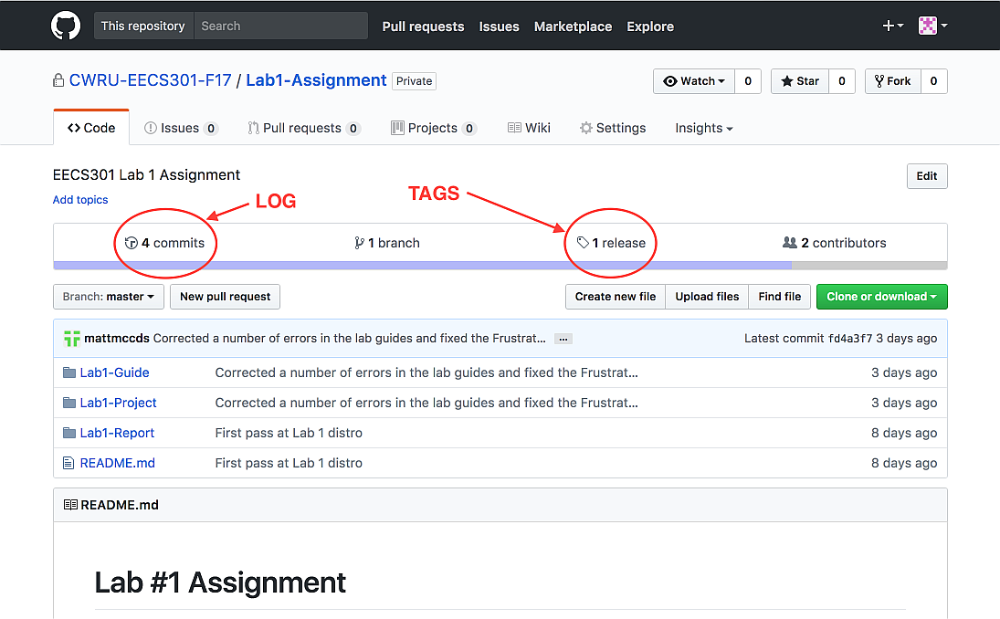
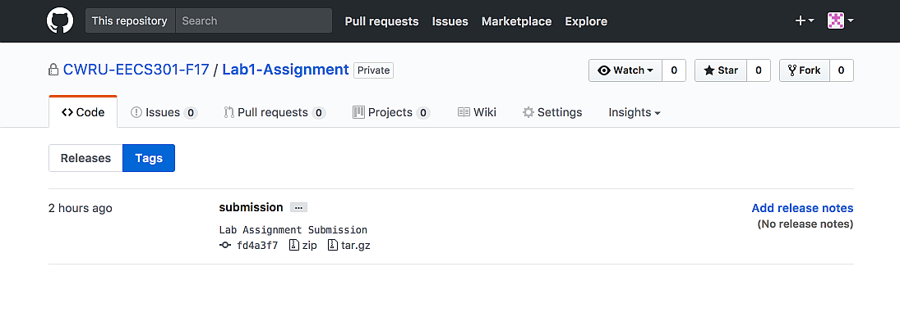

# GitHub Lab Assignment Submission

After completing all of the Lab work, you'll need to commit all your changes back into the Git repository then push the changes back to GitHub for grading.  A submission tag must be applied to the commit so the graders know what work to grade.

**Summary of the process:**

1. Use `git status` to see what files have changed.
1. Use `git diff` to see what in specific files has changed.
1. Use `git add` to stage all the changed files for the commit.
1. Use `git commit`, after the files are staged, to add the changes to the local repository.
1. Use `git push` to push the changes back to the GitHub repository.
1. Use `git tag` to apply the `submission` tag for grading.

The following two sections, [Commit Project Changes](#commit-project-changes) and [Submission Procedure](#submission-procedure) walkthrough the Lab Assignment Submission process in more detail.


## Commit Project Changes

Before submitting the lab assignment, all project changes must be committed to the lab assignment repository using the same procedure outlined in the Git Tutorial from Lab 1.

**Commit Procedure:**

1. Open **Git-Bash** and change the directory to your lab assignment repository (if you haven't already).
	
	```shell
	$ cd /h/Projects/EECS301/lab4-assignment-user
	```

1. Use `git status` to display what files have been changed in your project.

	```shell
	$ git status
	On branch master
	Your branch is up-to-date with 'origin/master'.
	Changes to be committed:
	  (use "git reset HEAD <file>..." to unstage)
	
	        modified:   Lab4-Project/ExFile1.v
	        modified:   Lab4-Project/ExFile2.v
	        modified:   Lab4-Project/ExFile3.v
	        
	```
        
1. The `git diff` command may be used to show you the changes that were made.

	```shell
	$ git diff Lab4-Project/File1.v
	```
	
1. Add all the changed files to the Commit Staging area using the `git add` command.

	```shell
	$ git add Lab4-Project/ExFile1.v
	$ git add Lab4-Project/ExFile2.v
	$ git add Lab4-Project/ExFile3.v
	```

1. If you stage a file by mistake, it can be removed using the `git reset` command.

	```shell
	$ get reset Lab4-Project/ExFile3.v
	```

1. Use the `git status` command to verify the staged file list.

	```shell
	$ git status
	On branch master
	Your branch is up-to-date with 'origin/master'.
	Changes to be committed:
	  (use "git reset HEAD <file>..." to unstage)
	
	        modified:   Lab4-Project/ExFile1.v
	        modified:   Lab4-Project/ExFile2.v

	Changes not staged for commit:
	  (use "git add <file>..." to update what will be committed)
	  (use "git checkout -- <file>..." to discard changes in working directory)
	
 	       modified:   Lab4-Project/ExFile3.v
 	       
	```

1. Once the staged files have been set, commit the files to the repository using the `git commit` command.

	```shell
	$ git commit
	```

	The text editor will be opened to enter a commit message.  If using nano, save the message with **Ctrl+o** and exit with **Ctrl+x**.
	
	Optionally, the commit message can set on the command line using the `-m` switch but only for terse messages.
	
	```shell
	$ git commit -m "Commit Message"
	```

1. The commit only updates the files in the local repository.  To synchronize your changes with the remote GitHub repository use the `git push` command. 

	```shell
	$ git push
	```

Refer back to the **Git Tutorial** from Lab 1 for a complete demonstration of the commit procedure.


## Submission Procedure

All lab assignments will be submitted using GitHub.

To submit the assignment, follow these steps using **Git Bash** (or an equivalent command-line `git` utility):

**Submission Procedure:**

1. Open **Git-Bash** and change the directory to your lab assignment repository (if you haven't already).
	
	```shell
	$ cd /h/Projects/EECS301/lab4-assignment-user
	```

1. Make sure any remote changes are pulled into the local repository before tagging the repository.

	```shell
	$ git pull
	Already up-to-date.
	```

1. Make sure all file changes are committed and you are on a clean working directory of the master branch by checking the status of the git repository.
		
	```shell
	$ git status
	On branch master
	Your branch is up-to-date with 'origin/master'.
	nothing to commit, working directory clean
	```

	**WARNING:** If you still have uncommitted files, you'll want to commit and push those files before applying the tag.

1. Apply the `submission ` tag to your repository using the `git tag` command:

	**WARNING:** Make sure the tag name is spelled `submission`, all lower case. This is important so the graders can find your submitted lab assignment.  
	
	```shell
	$ git tag -a submission -m "Lab Assignment Submission"
	```
	
1. Double-check the `submission` tag was applied correctly by checking the log.

	```shell
	$ git log
	commit fd4a3f7f056caec7e77c093c40baffc4086d726b (HEAD -> master, tag: submission, origin/master, origin/HEAD)
	Author: User AtCase <user@case.edu>
	Date:   Tue Sep 5 18:20:02 2017 -0400

    Lab Assignment Commit Message.

	```
	
	The submission tag should appear on the most recent commit at the top of the log viewer window with the message:
	
	```
	(HEAD -> master, tag: submission, origin/master, origin/HEAD)
	```
	
	Press **q** to exit the log viewer (single page logs may exit automatically).
	
1. All of the changes so far have been to the local repository on your development machine.  Next, push the local changes up to the remote repository on GitHub (including the tag just created).

	```shell
	$ git push --tags
	Counting objects: 1, done.
	Writing objects: 100% (1/1), 170 bytes | 0 bytes/s, done.
	Total 1 (delta 0), reused 0 (delta 0)
	To git@github.com:CWRU-EECS301-F17/lab4-assignment-user.git
	 * [new tag]         submission -> submission
	```
	
1. Double-check that your lab assignment work with the `submission` tag was pushed to GitHub by using the GitHub web interface to review your lab assignment repository.

	Go to the [EECS301 GitHub](http://github.com/CWRU-EECS301-F17) homepage and open your lab assignment repository.
	
	On GitHub, tags are listed on the **Releases** page (click on the link marked **TAGS** shown below).

	
	
	On the Releases page, the submission tag should be listed under **Tags**.
	
	


:warning: **WARNING:** It is very important that your work to be graded is on the `master` branch and tagged with the `submission` tag.  The graders will pull against that branch and tag for grading.  If they cannot find the submission you may not get credit for the lab.


## Submission Problems

If you tagged your repository with the `submission` tag but then make additional changes, you'll need to move the tag so the most recent update will be pulled by the graders.

Use the following procedure **only** if you need to update the repository after already tagging the repository.

**NOTE:** At the submission deadline, an automated tool will collect all the lab assignments by cloning against the `submission` tag of everyones repository. Any changes to the `submission` tag after the deadline will not be included in the grading archive.

**Submission Re-tag Procedure:**

1. Open **Git-Bash** and change the directory to your lab assignment repository (if you haven't already).

1. Remove the `submission` tag from the remote repository.

	```shell
	$ git push origin :refs/tags/submission
	```
	
1. Move the local `submission` tag to the most recent (`HEAD`) commit.

	```shell
	$ git tag -f -a submission
	```
	
1. Check the log to insure the submission tag is on the most recent commit.

	```shell
	$ git log
	commit fd4a3f7f056caec7e77c093c40baffc4086d726b (HEAD -> master, tag: submission, origin/master, origin/HEAD)
	Author: User AtCase <user@case.edu>
	Date:   Tue Sep 5 18:20:02 2017 -0400

    Lab Assignment Commit Message.

	```

1. Push the new `submission` tag to the remote GitHub repository.

	```shell
	$ git push -f origin submission
	```
	
1. Double-check the changes were made on GitHub using the web interface to check the **Releases** page.


## References

* [Git Reference Manual](https://git-scm.com/docs)

---

Return to the [Lab 4 Assignment](../README.md) page...
