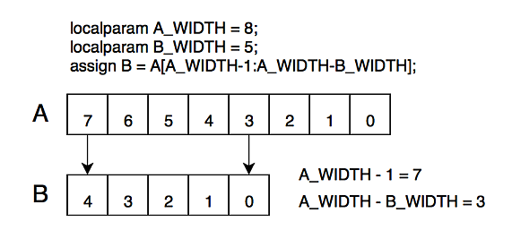
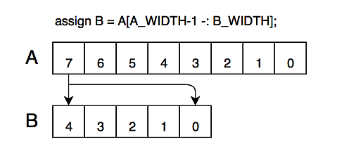
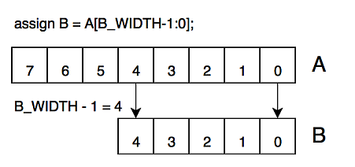
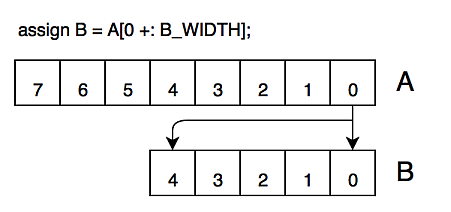

# Lab #4: HDL Refernce Guide

This document describes useful components that will be needed for this lab.

## Hardware Description Language

Modern FPGA designs utilize [**Hardware Definition Language (HDL)**](https://en.wikipedia.org/wiki/Hardware_description_language) to speed development by allowing logic circuits to be described in high-level abstract terms. This is similar to how languages like C/C++ or Python make software development easier rather than writing code in assembly language.

The two main HDLs used for FPGA development are [**Verilog**](https://en.wikipedia.org/wiki/Verilog) and [**VHDL**](https://en.wikipedia.org/wiki/VHDL).  Both languages were developed around the same time for the same purpose (ASIC verification) therefore share many common features and concepts.  

Similarly, both languages employ hierarchical modular design techniques and synthesize high-level behavioral descriptions into gate-level logic netlists which can be verified through simulation or mapped onto an FPGA fabric.

The main difference between the two languages is syntax.  The Verilog language was based on [**C**](https://en.wikipedia.org/wiki/C_(programming_language)) whereas VHDL was based on [**Pascal**](https://en.wikipedia.org/wiki/Pascal_(programming_language)) (or [ADA](https://en.wikipedia.org/wiki/Ada_(programming_language))).  The examples in this document highlight the similarities in structure while showing the differences in syntax between the two languages.

The remainder of this document will describe basic [HDL Constructs](#hdl-constructs), with both Verilog and VHDL examples, and provide an [FPGA Component Reference](#fpga-component-reference) for the elements needed for the Lab 2 Project design.


---

# HDL Constructs

The main HDL constructs needed for Lab 2 will be described in the following section.  While not a comprehensive overview of the languages, the main concepts needed for the lab are covered.

## Modules

Modular design is a key feature of high-level languages that make developing large projects easier.  Both Verilog and VHDL were designed with modular design principles in mind so both languages have strong syntactic support for creating well defined module interfaces. These modular building blocks assemble to create larger hierarchical designs.

The modular design approach allows for verifying the functionality of individual modules before they are incorporated into a larger design.  This unit-testing improves the overall design quality and integrates nicely with many of the popular testing-driven design methodologies used in other software development fields.

Verilog and VHDL have different syntax for modules but the underlying principle is the same.  In Verilog, the module descriptor is `module`; whereas, in VHDL, the module descriptor is `entity`.

The following example shows the same module implemented in both Verilog and VHDL.

**Verilog:**

```verilog
module example_module
(
	input a, b, c,
	output z
);

	assign z = (a & b) ^ c;
	
endmodule
```

**VHDL:**

```vhdl
library IEEE;
use IEEE.STD_LOGIC_1164.ALL;

entity example_module is
port
(
	a, b, c : in std_logic;
	z : out std_logic
);
end entity;
architecture rtl of example_module is
begin

	z <= (a and b) xor c;
	
end rtl;
```

In both example implementations, the **Port** definition specifies three input signals (a, b, and c) and one output signal (z).  The VHDL module requires more boilerplate syntax but the two are very similar in the end.

**NOTE:** Verilog allows some flexibility in the way modules are defined and many Verilog reference books do not structure the module definition as shown here.  This is unfortunate because their examples are usually less straight-forward and make seeing the similarity between the two languages harder.

### Module Instantiation

After defining a module, the next step is to actually use it.  Defining an instance of a module is called an **instantiation**.  Modules can be instantiated as many times as needed, but each instance requires a unique name.

The following examples shows how to instantiate the previously defined modules with the instance name `example_inst` inside another module called `container_module`.

Module instantiations must always be named so the synthesizer can differentiate between different instances of the same module.

**Verilog:**

In Verilog, port signals are assigned with the syntax `.port_name ( signal_to_connect ),`.

* Input signals to the module use either the _wire_ or _reg_ type.
* Output signals from the module must be the _wire_ type.
* In-line logic operations are allowed for input signals.
* Signal concatenations can be used for either input or output signals.
* The signal width must match the port width.
* A comma is placed at the end of each port signal except for the last port.


```verilog
module container_module
(
	input  a_in,
	output z_out
);

	wire b_in = 1'b0;
	
	example_module example_inst
	(
		.a( a_in ),
		.b( b_in ),
		.c( a_in & b_in ),
		.z( z_out )
	);
	
endmodule
```

**VHDL:**

The equivalent module instantiation is shown here in VHDL.

Unlike Verilog, modules must have a **component** declaration before being instantiated in a module.  The component declaration mirrors the entity definition.  When making changes to an entity's port list, remember to modify the component declaration as well as any instantiations.  This third step is usually forgotten but will be caught by the compiler.

The component declaration can be made in the architecture declaration block, as shown in the example.  Components can also be packaged and declared as a group.

The port signals are assigned with the syntax `port_name => signal_to_connect,`


```vhdl
library IEEE;
use IEEE.STD_LOGIC_1164.ALL;

entity container_module is
port
(
	a_in : in std_logic;
	z_out : out std_logic
);
end entity;
architecture structural of container_module is

	signal b_in : std_logic := '0';
	signal c_temp : std_logic;

	component example_module
	port
	(
		a, b, c : in std_logic;
		z : out std_logic
	);
	end component;
begin

	c_temp <= a_in and b_in;
	
	example_inst : example_module 
	port map
	(
		a => a_in,
		b => b_in,
		c => c_temp,
		z => z_out
	);
	
end structural;
```

**NOTE:** You'll notice how much more VHDL text is required to implement the same logic as the Verilog implementation.  This is the primary complaint when comparing VHDL vs Verilog.

**NOTE:** Mixed-language designs are possible and are supported by the version of Quartus and ModelSim used for the class.


### Module Naming

Module names should be descriptive to give an indication of what the module does.  Using postfix action words helps, some examples: generator, transmitter, receiver, transceiver, arbiter, selector, computator, etc...  Usually, the top level of a larger functional block can just postfixed with _module_ to indicate it encapsulates the functionality described.

As the functionality of large modules are broken down in to many sub-modules, it is often convenient to use a common prefix for all module names so the module files are grouped together.  This makes it easer to find and copy all files associated with a module.

The prefix can be a common term base on function (i.e. UART, FPU, or ADC) or it could be an acronym of the main module name.  Whatever makes sense, although if too non-obvious, make sure to comment what the prefix means in the header description.

**Naming Examples:**

```
SRC_Some_Really_Cool_Module
  SRC_Arbiter
  SRC_Generator
  SRC_Transceiver
UART_Module
  UART_Baud_Generator
  UART_Transmitter
  UART_Receiver
```

**WARNING:** Module names **can not** start with a number.

### Files

By coding-style convention, each file should contain only one module and the name of the file (excluding the extension) should match the name of the module exactly, including capitalization.  This convention improves code maintenance and reusability.

For example, the Verilog module `Example_Module` would be stored in the file `Example_Module.v`.

### Header Blocks

All files in a project should have a descriptive header block at the top of the file.  The comment block should provide useful information about the module.

**Verilog:**

Verilog uses C style comments where `//` comments the remaining line and `/* */` comments a multi-line block.

In addition to the comment block, Verilog files need to have a timescale parameter defined for the simulator. The following example defines a time unit of 1 ns and the smallest unit of time as 1ps.  This is the most common setting and should be used unless there's a very good reason to change it.
 
```verilog
`timescale 1ns / 1ps
//////////////////////////////////////////////////////////////////////////////////
// Company: <Company>
// Engineer: <You>
// 
// Create Date:    23:43:00 05/01/2017 
// Project Name:   <Project Name>
// Design Name:    <Design Name>
// Module Name:    <Module Name>
// Target Devices: <FPGA Family>
// Tool versions:  <Design Tool & Version>
// Description:    
//                 
// Dependencies:   
//
//////////////////////////////////////////////////////////////////////////////////
```

**VHDL:**

VHDL uses ADA style comments where `--` comments the remaining line.

The library includes should be at the top of the file after the comment header.

```vhdl
----------------------------------------------------------------------------------
-- Company: <Company>
-- Engineer: <You>
-- 
-- Create Date:    23:43:00 05/01/2017 
-- Project Name:   <Project Name>
-- Design Name:    <Design Name>
-- Module Name:    <Module Name>
-- Target Devices: <FPGA Family>
-- Tool versions:  <Design Tool & Version>
-- Description:    
--                 
-- Dependencies:   
--
----------------------------------------------------------------------------------
library IEEE;
use IEEE.STD_LOGIC_1164.ALL;
use IEEE.NUMERIC_STD.ALL;

```

## Signal Types

In Verilog, signals can be either **registers** or **wires**, defined by `reg` or `wire`.  Wires are combinatorial signals only whereas registers may be either combinatorial or sequential.  

The typical VHDL equivalent for signal type is `std_logic` but there are a number of signal types available depending on which libraries are included.

When writing code for a CPU, data variables are defined in units of the CPU bus width (typically 8, 16, 32 or 64 bits wide).  For FPGA designs, buses are formed of any width using individual signals making it much easier to optimize a design to the data processing requirements.

**Verilog:**

```verilog
reg  a_reg;   // 1-bit wide register
wire a;       // 1-bit wide signal
reg  [7:0] b; // 8-bit wide register
```

**VHDL:**

```vhdl
signal a : std_logic;  // 1-bit wide signal or register
signal b : std_logic (7 downto 0); // 8-bit wide signal
```


## Signal Assignments

### Blocking / Non-Blocking

In Verilog, there are two types of signal assignments: Blocking and Non-Blocking.  Blocking assignments use the `=` operator and Non-Blocking assignments use the `<=` operator.

| Type | Syntax |
|------|--------|
| Blocking | `a = 1'b1;` |
| Non-Blocking | `a <= 1'b1;` |

The difference between the two types can be thought of as _serial operation_ vs _parallel operation_.  Blocking assignments will be made sequentially within a process scope whereas Non-Blocking assignments are all made simultaneously.

By nature, FPGA logic is massively parallel so Blocking assignments don't make sense and are considered to be non-synthesizable.  When targeting FPGA logic only Non-Blocking assignments should be used.

Where Blocking assignments do come into play is in simulation.  Sequential operations using blocking assignments can be used to quickly create behavioral test sequences without having to worry about generating actual logic gates.

A quick rule of thumb: Only use Blocking assignments, `=`, in **Initial** blocks and only use Non-Blocking assignments, `<=`, in **Always** process blocks.  Never mix the two.

### Concatenation

Multiple signals can be grouped together, creating larger signal buses, using the concatenate operator.  This operator will be used in the [shift register](#shift-registers) implementation later on.

In Verilog, the basic concatenate operator syntax is `{ a, b }`.  Multiple signals can be concatenated by adding more signals.  The resulting bus width will be the sum of all individual signal widths.

**Verilog:**

```verilog
wire       a, b, c, d;
wire [3:0] z;

assign z = { d, c, b, a };
```

In VHDL, the `&` operator is used for concatenation.

**VHDL:**

```vhdl
signal a, b, c, d : std_logic;
signal z : std_logic_vector (3 downto 0);

z <= d & c & b & a;
```

### Replication

Replication is similar to Concatenation.  The two main uses are sign extension and creating initial value constants.

In Verilog, the concatenation operator is used with slightly different syntax:  `{n{a}}`.  The signal `a` will be replicated `n` times then concatenated together.  The resulting signal width is `n` times the width of `a`.

**Verilog:**

```verilog
wire  [7:0] zero_byte;
wire  [7:0] a;
wire [15:0] a_sign_extend;

assign zero_byte = {8{1'b0}};
assign a_sign_extend = { {8{a[7]}}, a };
```

In VHDL, the equivalent syntax is 

**VHDL:**

```vhdl
signal zero_byte : std_logic_vector (7 downto 0);
signal a : std_logic_vector (7 downto 0);
signal a_sign_extend : std_logic_vector (15 downto 0);

zero_byte <= (others => '0');
a_sign_extend <= ((15 downto 8) => a(7)) & a(7 downto 0);
```

### Bus Vector Sections

In Verilog, bus variables can be sectioned using three different syntax methods.

* [ Upper : Lower ]

	The first method specifies the Upper and Lower indexes of the array.  This method is similar to indexing in other languages, including C.
	
* [ Upper -: Width ]

	The next method specifies the Upper index starting point then counts down Width number of bits.  This method is convenient when computing the index locations in a generation loop.
	
* [ Lower +: Width ]

	The last method is the opposite of the previous, where the Lower index starting point is specified then Width number of bits is counted up.

#### Vector Sectioning Examples

```Verilog
localparam A_WIDTH = 8;
localparam B_WIDTH = 5;

assign B0 = A[A_WIDTH-1 : A_WIDTH-B_WIDTH];
assign B1 = A[A_WIDTH-1 -: B_WIDTH];
assign B2 = A[A_WIDTH-B_WIDTH +: B_WIDTH];
```










## Operators

* **Logical Operators**
	* Used with boolean values
	
* **Bit-wise Operators**
	* Used with binary values
	

### Logic Operators

| Operation |  Syntax  |
|:---------:|:--------:|
| Equal     | a == b   |
| Not Equal | a != b   |
| And       | a && b   |
| Or        | a &#124;&#124; b |
| Not       | !a       |

### Bit-wise Operators

| Operation |  Syntax  |
|:---------:|:--------:|
| NOT       | ~a       |
| AND       | a & b    |
| OR        | a &#124; b |
| XOR       | a ^ b    |


### Logical Operatior Usage

```Verilog
wire event;
wire [3:0] condition;

if ( (event == 1'b1) && (condition != 4'h7) )
	State <= S1;
```

### Implied Boolean Value

```Verilog
wire event;

if (event)
	State <= S1;
```

Transitions when event == 1'b1

### Vector Boolean Values

| Vector  | Boolean Value |
|:-------:|:-------------:|
| 4'h0000 |    False      |
| 4'h0001 |    True       |
| 4'h1010 |    True       |
| 4'h1111 |    True       |


### Bit-wise Operator Usage

```Verilog
wire [3:0] a = 4'b1010;
wire [3:0] b = 4'b1011;
wire [3:0] c;

assign c = a & b;  // Result: 4'b1010;
assign c = a | b;  // Result: 4'b1011;
assign c = a ^ b;  // Result: 4'b0001;
assign c = ~a & b; // Result: 4'b0001;
```

### Bit-wise Reduction Operations

```Verilog
wire [3:0] a = 4'b0110;
wire b, c;

// AND all bits of 'a' together
assign b = &a; // Result: 1'b0

// Equivalent to:
assign c = a[3] & a[2] & a[1] & a[0];
```

### Bit-wise Reduction Operators

| Operation | Syntax |
|:---------:|:------:|
| AND       | &a    |
| OR        | &#124;a   |
| XOR       | ^a    |
| NAND      | ~&a   |
| NOR       | ~&#124;a   |
| NXOR      | ~^a   |

### Bit-wise NOT

* Looks like a reduction operator but is not

```Verilog
wire [3:0] a = 4'b1010;
wire [3:0] b;

assign b = ~a; // Result: 4'b0101

// Equivalent to:
assign b = { ~a[3], ~a[2], ~a[1], ~a[0] };
```

### If with Bit-wise operators

If statements allow bit-wise operators to be used as logical operators.

```Verilog
wire [3:0] events;

if (events)
	State <= S1;
```

When `events == 4'h0000` statement is False, any other setting is True.


## Parameters

For software development in general, parametrizing code is a good coding practice to improve code portability and reuse.  For HDL languages, using parameters can greatly simplify designs and makes coding easier.

Both Verilog and VHDL provide a mechanism to pass parameters to a module when it is instantiated.

**Verilog:**

Verilog has two parameter keywords: 

* `parameter` which is global in scope.
* `localparam` which is local in scope.

For module definitions, the parameter list is contained within the `#(  )` section and should only use the `parameter` keyword.  

A default value may be provided as shown in the example.  This default is used if the instantiation does not specify a value.

```verilog
module Parametrized_Module
#(
	parameter  REGISTER_WIDTH = 16, // Defaults to 16-bit
	parameter  CLK_RATE_MHZ = 50    // Defaults to 50 MHz
)
(
	input      [REGISTER_WIDTH-1:0] a;
	output reg [REGISTER_WIDTH-1:0] z;
);

localparam CLK_PERIOD_NS = 1000.0 / CLK_RATE_MHZ; // 20 nS for 50 MHz

endmodule;
```

**VHDL:**

In VHDL, parameters are called **generics**.  

For module definition, the _generic map_ works the same as the _parameter list_.


```vhdl
entity Parametrized_Module is
generic (
	REGISTER_WIDTH : integer := 16; -- Defaults to 16-bit
	CLK_RATE_MHZ : integer := 50    -- Defaults to 50 MHz
);
port (
	a : in std_logic_vector (REGISTER_WIDTH-1 downto 0);
	z : out std_logic_vector (REGISTER_WIDTH-1 downto 0)
);
end Parametrized_Module;
```

---

Parameters will be used in various ways throughout the course.  The first example will appear in the [Counters](#counters) section later in this document. 

Before that, consider a design that has 100 time-counters, all counting different numbers of clock ticks, running on a 50 MHz clock system clock.  You hard-coded each counter with the number of ticks to count.  The day before the project deadline, your boss says that Marketing decided that the system should use a 100 MHz because it looks better on the spec sheet (no seriously).  Now you get to spend the rest of the day (and most of the night) updating all the hard-coded values for the 100 counters because the faster clock halved the tick time being counted.

After considering that hard-coded design, be sure to read the Counter section extra carefully which describes the mechanism by which all 100 counters could be updated by changing a single parameter.


## Processes

In HDL, logic groups are broken down into blocks called processes.  A process block can define either combinatorial or sequential logic.

It is good coding practice to group only tightly related logic into a process.  Grouping unrelated logic in a process can sometimes have unintended consequences.

Processes in Verilog and VHDL both have a sensitivity list, which defines which signals cause the process to execute.  In practice, the sensitivity list for sequential logic should only include a Clock edge (rising or falling) and possibly an asynchronous Reset signal.  For combinatorial logic, all input signals must be included in the sensitivity list, if not, a latch will be inferred which would impact performance and should be avoided.

**Verilog:**

In Verilog, the process block definition uses the keyword `always`.

The following example shows a sequential process which acts on the rising-edge of the CLK signal and the rising-edge of the RESET signal.  

The process will synthesize into a register, clocked on the rising-edge of the CLK signal and asynchronously reset when the RESET signal is asserted high.

```verilog
always @(posedge CLK, posedge RESET)
begin
	if (RESET)
	begin
		// Reset State
	end
	else
	begin
		// Sequential logic clocked on the rising-edge of CLK
	end
end
```

A combinatorial logic process should execute when any of the input signals change.  The process sensitivity list should include all the input signals.  In Verilog, the `@*` will automatically include all inputs for the process.  This is less error-prone than trying to maintain an exact list of all input signals.

```verilog
always @*
begin

end
```

System Verilog introduced the `always_comb` and `always_ff` keywords to explicitly state the intent of the process block so the synthesizer can flag errors if the logic violates the intent.

**VHDL:**

VHDL equivalent sequential process.

```vhdl
process_label : process(CLK, RESET)
begin
	if RESET = '1' then
		-- Reset State
	elsif rising_edge(CLK) then
		-- Sequential logic clocked on the rising-edge of CLK
	end if;
end process;
```

VHDL equivalent combinatorial process.

```vhdl
process_label : process (all)
begin

end process;
```


## Registers

Registers (aka flip-flops) are the primary storage mechanism on an FPGA.  The cells that make up the FPGA fabric have at least one LUT and one register.  New architectures, like the Cyclone V, have multiple registers per LUT to reduce signal fanout which improves signal routing and latency.

The following example shows two register variations. The first register is updated on every rising-edge clock cycle.  The second is only updated when the `b_enable` signal is asserted.

**Verilog:**

A register is created by setting the process sensitivity list to act on the rising-edge of the clock signal: `always @(posedge CLK)`.  An asynchronous Reset signal may be added but no other signals should be included in the list.

Clocking registers on the falling-edge is possible by changing `posedge CLK` to `negedge CLK` but for the lab assignments stick to the rising-edge.  There are clock-domain issues to take into consideration when mixing logic clocked on different edges that will be discussed in later labs.

```verilog
reg  a_reg;
reg  b_reg;
reg  c_reg;

// Register loaded every clock edge
always @(posedge CLK)
begin
	a_reg <= a;
end

// Register loaded only when b_enable is asserted
always @(posedge CLK)
begin
	if (b_enable)
		b_reg <= b;
end

// Register, with asynchronous Reset, enabled by b_enable
always @(posedge CLK, posedge RESET)
begin
	if (RESET)
		c_reg <= 1'b0;
	else if (b_enable)
		c_reg <= a & b;
end
```

**VHDL:**

```vhdl
signal a_reg : std_logic;
signal b_reg : std_logic;
signal c_reg : std_logic;

-- Register loaded every clock edge
a_reg_proc : process (CLK)
begin
	if rising_edge(CLK) then
		a_reg <= a;
	end if;
end process;

-- Register loaded only when b_enable is asserted
b_reg_proc : process (CLK)
begin
	if rising_edge(CLK) then
		if b_enable = '1' then
			b_reg <= b;
		end if;
	end if;
end process;

-- Register, with asynchronous Reset, enabled by b_enable
c_reg_proc : process (CLK, RESET)
begin
	if RESET = '1' then
		c_reg <= '0';
	elsif rising_edge(CLK) then
		if b_enable = '1' then
			c_reg <= a and b;
		end if;
	end if;
end process;
```

**NOTE:** Many VHDL books will present register processes using the `if CLK'event and CLK = '1' then` syntax instead of `if rising_edge(CLK) then`.  These are mostly the same except that the `rising_edge()` function also verifies the type of transition event.  In simulation, this could catch issues missed by the `CLK'event and CLK = '1'` syntax.

## Look-Up Tables

Loop-Up Tables (LUT) are useful in wide array of applications and are the key building block of virtually all FPGA architectures.  In the Cyclone V, each ALM can be configured as a 6-input LUT with a 1-bit output (there are also a number of other configurations) forming a 64x1-bit ROM memory.

Look-Up Tables have a number of applications such as storing data constants or creating logic functions.

The following example shows a look-up table loaded with 16-bit sine wave data constants.

**Verilog:**

```Verilog
wire  [3:0] sin_sel;
reg  [15:0] sin_val;

always @(posedge CLK)
begin
	case (sin_sel)
		4'h0 : sin_val <= 16'h8000;
		4'h1 : sin_val <= 16'hb0fb;
		4'h2 : sin_val <= 16'hda82;
		4'h3 : sin_val <= 16'hf641;
		4'h4 : sin_val <= 16'hffff;
		4'h5 : sin_val <= 16'hf641;
		4'h6 : sin_val <= 16'hda82;
		4'h7 : sin_val <= 16'hb0fb;
		4'h8 : sin_val <= 16'h8000;
		4'h9 : sin_val <= 16'h4f04;
		4'hA : sin_val <= 16'h257d;
		4'hB : sin_val <= 16'h09be;
		4'hC : sin_val <= 16'h0000;
		4'hD : sin_val <= 16'h09be;
		4'hE : sin_val <= 16'h257d;
		4'hF : sin_val <= 16'h4f04;
	endcase
end	
```

**VHDL:**

```vhdl
signal sin_sel : std_logic_vector (3 downto 0);
signal sin_val : std_logic_vector (15 downto 0);

sin_lut_proc: process (CLK)
begin
	if rising_edge(CLK) then
		case sin_sel is
			when x"0" => sin_val <= x"8000";
			when x"1" => sin_val <= x"b0fb";
			when x"2" => sin_val <= x"da82";
			when x"3" => sin_val <= x"f641";
			when x"4" => sin_val <= x"ffff";
			when x"5" => sin_val <= x"f641";
			when x"6" => sin_val <= x"da82";
			when x"7" => sin_val <= x"b0fb";
			when x"8" => sin_val <= x"8000";
			when x"9" => sin_val <= x"4f04";
			when x"A" => sin_val <= x"257d";
			when x"B" => sin_val <= x"09be";
			when x"C" => sin_val <= x"0000";
			when x"D" => sin_val <= x"09be";
			when x"E" => sin_val <= x"257d";
			when x"F" => sin_val <= x"4f04";		end case;
	end if;
end process;
```

## Multiplexers

Multiplexer structures are used a great deal in FPGA design (mainly due to State Machine usage).  


### Combinatorial Multiplexer

Here's an example of a simple, non-registered, multiplexer data selector:

**Verilog:**

In Verilog, the standard multiplexer syntax uses the `case` operator to select 


```verilog
wire [1:0] mux_sel;
reg  [7:0] mux;

always @*
begin
	case (mux_sel)
		2'h0 : mux <= a;
		2'h1 : mux <= b;
		2'h2 : mux <= c;
		2'h3 : mux <= d;
	endcase
end
```

### Registered Multiplexer

Here's the same multiplexer but with a registered output.  

```verilog
wire [1:0] mux_sel;
reg  [7:0] mux;

always @(posedge CLK)
begin
	case (mux_sel)
		2'h0 : mux <= a;
		2'h1 : mux <= b;
		2'h2 : mux <= c;
		2'h3 : mux <= d;
	endcase
end
```

Notice that in both examples the variable `mux` is type reg since it is being assigning in a process block even though the first example does not actually create a register.

A two input multiplexer can also be created with an if-then-else structure.  Many times this structure describes logic more succinctly.

```verilog
always @(posedge CLK)
begin
	if (mux_sel)
		mux <= a;
	else
		mux <= b;
end
```

**VHDL:**

```vhdl
mux_proc : process (CLK)


end process;
```

## Priority Encoder

Priority encoders are used to select an output value based on a number of discrete inputs.  The inputs are processed sequentially to see which one has precedence.

**NOTE:** Usually, the multiplexer structure results in more optimal logic so take time to consider whether using a multiplexer will better suite your logic needs first before using priority encoder.

In the following example, a STATUS output is assigned based on two different EVENT signals.  EVENT\_A has priority over EVENT\_B so if they are both asserted simultaneously then EVENT\_A takes precedence and the output will be 2'h1.

```Verilog
input EVENT_A;
input EVENT_B;
input EVENT_C;
output reg [1:0] STATUS;

always @(posedge CLK)
begin
	if (EVENT_A)
		STATUS <= 2'h1;
	else if (EVENT_B)
		STATUS <= 2'h2;
	else if (EVENT_C)
		STATUS <= 2'h3;
end
```

The following table shows the logic for the encoder (`X` means _don't care_ so either 0 or 1).

| EVENT_A | EVENT_B | EVENT_C | STATUS |
|:-------:|:-------:|:-------:|:------:|
| 0 | 0 | 0 | No Change |
| 1 | X | X | 2'h1 |
| 0 | 1 | X | 2'h2 |
| 0 | 0 | 1 | 2'h3 |


---

# FPGA Component Reference

## Adders

The core building blocks of modern FPGAs typically include dedicated adder logic, fast carry-chains, and registers.

The core building block of Altera's Cyclone V family is the **ALM**.  Each ALM has two dedicated adders (fed by a 4-input LUT on each input for additional logic), a hard-wired fast carry chain (connected to the adjacent ALMs), and output registers to store the adder result.


Constructing an adder with an output register is simple to describe in HDL.  The following example shows, in both Verilog and VHDL, how to construct an unsigned 8-bit registered output adder with full 9-bit result.

**NOTE:** For both examples, the concatenate operation, `{ 1'b0, A }` or `( '0' & A )`, extends the input signals to the output bit width to avoid compiler warnings of mis-matched bus widths.

* Verilog
	
	```verilog
	module Adder_Demo
	(
		input            CLK;
		input      [7:0] A;
		input      [7:0] B;
		output reg [8:0] RESULT;
	);
	
		always @(posedge CLK)
		begin
			RESULT <= { 1'b0, A } + { 1'b0, B };
		end 
	
	endmodule
	```
	
* VHDL

	```vhdl
	library ieee;
	use ieee.std_logic_1164.all;
	use ieee.numeric_std.all;
	
	entity Adder_Demo is
	port (
		CLK : in std_logic;
		A : in unsigned (7 downto 0);
		B : in unsigned (7 downto 0);
		RESULT : out unsigned (8 downto 0)
	);
	end Adder_Demo;
	
	architecture Behavioral of Adder_Demo is
	begin
		Adder_Reg: process (CLK)
		begin
			if rising_edge(CLK) then
				RESULT <= ('0' & A) + ('0' & B);
			end if;
		end process Adder_Reg;
	end Behavioral;
	```


## Counters

Counters are one of the most used components in FPGA designs.  Normally, a counter is used to count some number of events, then when some count value is reached an action is taken.

Here's an example of a simple counting structure to generate a tick signal every 75 clock cycles:

```Verilog
// Generate a clock tick every 75 clock cycles
reg [7:0] counter;
reg       clock_tick;

always @(posedge CLK)
begin
	if (counter == 8'd74)  // One less for continuous counter overlap
	begin
		clock_tick <= 1'b1;  // Assert clock tick
		counter <= 8'h00;    // Clear the counter
	end
	else
	begin
		clock_tick <= 1'b0;        // Deassert clock tick
		counter <= counter + 1'b1; // Increment the counter
	end
end
```

The counter starts at 0 and counts up to 74 then generates a clock tick pulse and starts counting over again at 0.

While this structure does work it has a number of issues, mainly caused by the comparator checking when the counter hits 74.  This comparator adds an extra layer of logic to detect when the counter has the rollover point.  For small counters, this extra logic may not amount to much, but for large counters the logic becomes significant.  The added logic layer increases the propagation time through the combinatorial logic which reduces the maximum clock rate the logic is capable of running.

### Rollover Counters

Optimizing the counter by removing the comparator would decrease the size and increase the speed of the logic.  This can be achieved by re-thinking the way we count.  Instead of starting at 0 and counting to some value, what if we start at a power-of-2 **rollover point** (larger than our value), subtract off the value we want to count to, then start counting up from that **load value** to the rollover point.  When we get to the rollover point, the upper bit of the register will change from 0 to 1, which signals the count value has been reached.  Now instead of having a comparator that looks at every bit of the counter, only the upper-most bit is monitored.

Take the example of counting to 5 using a rollover counter:

| Counter Reg (in binary) | Tick | Counts |   |
|:------------------------:|:------:|:----:|---|
| 1000 | 1 | 5  |  Rollover Point |
| 0111 | 0 | 4  |   |
| 0110 | 0 | 3  |   |
| 0101 | 0 | 2  |   |
| 0100 | 0 | 1  |   |
| 0011 | 0 | 0  | <- Load Value  |
| 0010 | 0 | 0  |   |
| 0001 | 0 | 0  |   |
| 0000 | 0 | 0  |   |

Using this method, a 3-bit comparator was replaced by adding an extra bit to the size of the adder (for the power-of-2 rollover point) and using that extra bit to signal when the count value has been reached.

Note the calculation for the **Load Value** in this example: 8 - 5 = 3.  There's actually two different ways to calculate the Load Value depending on the counter's purpose.

1. For a single event counter: `Rollover_Point - Count_Time = Load_Value`

	This type of counter will start counting on some event, then signal when done and wait for the next start counting event.
	
2. For a continuous counter: `Rollover_Point - Count_Time + 1 = Load_Value`

	Continuous counters will need to overlap the start and ending clock cycles to get the desired time between ticks.  Adding one to the Load Value actually removes a clock cycle which accounts for the overlap. 
	
3. Custom counter: `Rollover_Point - Count_Time + N = Load_Value`

	Depending on other logic in your system, you may want the counter to account for the event signal time or tick response times.  Typically, this means subtracting an extra clock cycle or two to make up for the time it took for the event signal to start the counter.  This is useful when trying to align signals from multiple state machines.

### Rollover Counter HDL Examples:

**WARNING:** The use of **magic numbers** in the following examples are poor coding style but make for a more straight forward example.  Parameter variables, with descriptive names, should be used for setting the counter load values.  The next section, [Programmatic Rollover Calculation](#programmatic-rollover-calculation), describes how this is done.

**Verilog:**

```Verilog
// Generate a clock tick every 75 clock cycles
reg [8:0] counter;
wire      clock_tick;

// Use upper-most counter bit for clock tick on rollover 
assign clock_tick = counter[8];

always @(posedge CLK)
begin
	if (clock_tick)
		counter <= (9'h100 - 9'd75 + 1'b1); // Reset the counter
	else
		counter <= counter + 1'b1; // Increment the counter
end
```

**VHDL:**

```vhdl

```

### Programmatic Rollover Calculation

A counter's rollover calculation can be hand computed and assigned but that leads to ***magic numbers*** which are poor coding practice.  Using `parameter` formulas to compute the rollover values is a much better option.

```Verilog
parameter CLK_RATE = 50 // MHz
parameter DELAY_TIME = 1000; // nS

localparam DELAY_TICKS = DELAY_TIME / (1000.0 / CLK_RATE);
localparam COUNT_WIDTH = bit_index(DELAY_TICKS);
localparam COUNT_ROLLOVER = { 1'b1, {CNT_WIDTH{1'b0}} };
localparam COUNT_LOADVAL = COUNT_ROLLOVER - DELAY_TICKS + 1'b1;

reg [COUNT_WIDTH:0] count_reg;  // Register width is set to COUNT_WIDTH + 1
```

### Runtime Load Values

Pre-computed count values are fine for many applications but sometimes the counter needs to adjust it's counting on-the-fly.  

By using the numerical identity `a - b = a + ~b + 1` and realizing that the fixed value of the rollover point means the upper bit of `a + ~b` is always 0, we can drop `a` from the equation, leaving the load value equal to `~b + 1`.

Setting the counter load value with an inverted signal is trivial and shouldn't require any extra logic. Adding 1 can be tricker but there are a number of ways, depending on the design, to shift the extra count around to eliminate the need for extra additions.


## Shift Registers

Shift registers are commonly used in serial data controllers, data pipelines, or computational functions. 

Shift regist


Example of an 8-bit shift register used to transmit serial data:

```Verilog
input       load;
input       next;
input [7:0] output_data;

reg   [7:0] shift_reg;
wire        shift_data_out;
	
assign shift_data_out = shift_reg[7];
	
always @(posedge CLK)
begin
	if (load)
		shift_reg <= output_data;
	else if (next)
	begin
		// Rotate left (MSB looped back to LSB)
		shift_reg <= { shift_reg[6:0], shift_reg[7] };
	end
end
```

**NOTE:** The concatenation operator `{ }` is used to create the shift in the register values by remapping each register input to its neighbor's output.

Shift registers can be shifted in a number of ways:

|  Shift Type  |  Concatenation Syntax |
|---|:---:|
| Left-shift rotation | `{ shift[6:0], shift_reg[7] }` |
| Right-shift rotation | `{ shift_reg[0], shift[7:1] }` |
| MSB data output  |  `{ shift[6:0], 1'b0 }` |
| LSB data output  |  `{ 1'b0, shift[7:1] }` |
| MSB data input  |  `{ shift[6:0], DIN }` |
| LSB data input  |  `{ DIN, shift[7:1] }` |

### Additional Shift Register Uses

The [Linear-Feedback Shift Register](https://en.wikipedia.org/wiki/Linear-feedback_shift_register) (LFSR) can generate pseudo-random noise patterns which are useful in a number of applications. Later labs will utilize [CRC](https://en.wikipedia.org/wiki/Cyclic_redundancy_check) and Parity calculations which are closely related to LFSRs.

```Verilog
wire      fb; // feedback
reg [7:0] sr; // shift register

initial
begin
	sr <= 8'hFF;  // initialize to all 1's
end

assign fb = sr[7]; // Feedback Most-Significant-Bit (MSB)

always @(posedge CLK)
begin
	// Feedback XOR'd on tap points (4, 5, 7)
	sr <= { sr[6]^fb, sr[5], sr[4]^ fb, sr[3]^ fb, sr[2], sr[1], sr[0], fb }
end
```


## Pulse-Width Modulation

Many applications use [Pulse-Width Modulation (PWM)](https://en.wikipedia.org/wiki/Pulse-width_modulation) for control, including driving the brightness of LEDs.

A PWM waveform has a base frequency set by the physical parameters of the device being controlled.  For an LED, anywhere from 300 to 1000 Hz is acceptable to avoid noticeable flicker.

For a PWM with a 1kHz base frequency, the **interval time** between cycles is 1ms.  Over this 1ms period, the signal will be high for a certain percentage of time and low the rest.  This percentage of on-time is called the **duty cycle**.

For example, a 75% duty cycle on the 1kHz PWM will result in the signal being low for 250us, switching high for 750us, then starting the cycle over again.


An efficient PWM implementation in FPGA logic uses two rollover counters.  One counter will set the PWM interval time for the base frequency, and the other counter sets the percentage of on-time during the interval period.

The **PWM Interval** counter simply generates a single clock tick at the end of every interval period.  This clock tick resets the **PWM Duty Cycle** counter.

The **PWM Duty Cycle** rollover counter will be loaded with the amount of off-time for the cycle.  When the counter rolls over, the upper bit flips from 0 to 1 and remains high until reset by the **PWM Interval** timer. The trick of the design is that the upper bit of the **PWM Duty Cycle** counter mimics the exact output required for the PWM so it can be output without any other fuss.

The following example implements a static 75% duty cycle, 1kHz base frequency PWM from a 50 MHz system clock.

**Verilog:**

```verilog
parameter CLK_RATE_HZ = 50000000; // Hz
parameter DUTY_RATE_HZ = 1000;  // Hz
parameter DUTY_PERCENT = 75;   // Cycle On-time %

// Compute the PWM Interval Counter Parameters
localparam PWM_INV_TICKS = CLK_RATE_HZ / DUTY_RATE_HZ;
localparam PWM_REG_WIDTH = bit_index(PWM_INV_TICKS);
localparam [PWM_REG_WIDTH:0] PWM_INV_LOADVAL = {1'b1, {PWM_REG_WIDTH{1'b0}}} - PWM_INV_TICKS + 1'b1;

// Compute the PWM Duty Cycle Counter Parameters
localparam integer PDC_OFF_TICKS = PWM_INV_TICKS * (100.0-DUTY_PERCENT) / 100;
localparam [PWM_REG_WIDTH:0] PDC_LOADVAL = {1'b1, {PWM_REG_WIDTH{1'b0}}} - PDC_OFF_TICKS[PWM_REG_WIDTH:0];

wire                   pwm_inv_tick;
reg  [PWM_REG_WIDTH:0] pwm_inv_count_reg;
reg  [PWM_REG_WIDTH:0] pdc_count_reg;

// PWM Interval Counter
assign pwm_inv_tick = pwm_inv_count_reg[PWM_REG_WIDTH];

always @(posedge CLK)
begin
	if (pwm_inv_tick)
		pwm_inv_count_reg <= PWM_INV_LOADVAL;
	else
		pwm_inv_count_reg <= pwm_inv_count_reg + 1'b1;
end

// PWM Duty Cycle Counter
always @(posedge CLK)
begin
	if (pwm_inv_tick)
		pdc_count_reg <= PDC_LOADVAL;
	else
		pdc_count_reg <= pdc_count_reg + 1'b1;
end

// PWM Output Register
always @(posedge CLK)
begin
	PWM_OUT <= pdc_count_reg[PWM_REG_WIDTH];
end
```

**VHDL:**

```vhdl

signal pwm_inv_count_reg : std_logic_vector(15 downto 0);

-- PWM Duty Cycle Counter
pdc_count_proc: process (CLK)
begin
	if rising_edge(CLK) then
		if pwm_inv_tick = '1' then
			pdc_count_reg <= PDC_LOADVAL;
		else
			pdc_count_reg <= pdc_count_reg + 1;
		end if;
	end if;
end process;

-- PWM Output Register
pwm_out_proc: process (CLK)
begin
	if rising_edge(CLK) then
		PWM_OUT <= pdc_count_reg(PWM_REG_WIDTH);
	end if;
end process;

```


## Input Signal Synchronization

The crossing of clock domains is a major issue when designing large FPGA systems with multiple clock frequencies driving different modules.  

Most input signals into an FPGA occur asynchronously to the system clock (one exception, covered in a later lab, would be source synchronous signals).  The Push Button and Switch signals are prime examples of asynchronous signals that will be addressed here.

The main problem asynchronous signals cause is due to the nature of the registers used to store the 


Input signals a


## Additional References

* Verilog Reference
	* [ASIC World Verilog Page](http://www.asic-world.com/verilog/index.html)
	* [Verilog Design Examples](https://www.altera.com/support/support-resources/design-examples/design-software/verilog.html)
* VHDL Reference 
	* [_"The Student's Guide to VHDL, Second Edition"_, Peter J. Ashenden](https://www.amazon.com/Students-Guide-Second-Systems-Silicon/dp/1558608656/ref=la_B000APA262_1_4?s=books&ie=UTF8&qid=1503858239&sr=1-4)
	* [VHDL Design Examples](https://www.altera.com/support/support-resources/design-examples/design-software/vhdl.html)
	* [VHDL Card](card_vhdl.pdf)


---

Return to the [Lab 2 Assignment](../README.md) page...