# Lab #4: Project Guide

## Overview

The previous labs have used simple combinatorial logic and counters as the control mechanism for the LED outputs.  In order to do more advanced control algorithms, a more advanced control mechanism is needed: the State Machine.

State Machines are widely used in FPGA designs.  A large project could have dozens or even hundreds of State Machines, all running in parallel, each working on their own little piece of the full design.

The main focus of this lab will be to introduce the basic concepts and HDL structure for State Machine design.  The lab project includes three State Machines.  The first has the full implementation provided as an example to show proper structure and syntax.  The second has a guided walk-though with instructions for each step of the creation process.  The final State Machine requires implementing the State Machine logic from scratch to meet the given design specification.

The project creates a simple calculator which can add or subtract one number at a time against an accumulator value.  The number is entered using the Slider Switches to make a 10-bit unsigned integer.  Clear, Add, and Subtract commands are issued with Push Button presses.  The Seven Segment display will show the calculator result in signed decimal format which requires converting the accumulator's binary value to a Binary Coded Decimal (BCD) format.

Test benches are provided for the **BCD Segment Decoder** and the **BCD Binary Encoder** modules which include an Automated Verification Testing routine to fully verify the module operation.  The testing routines compute an expected result for the test stimulus provided to the module being tested, then checks that the output signals from the module match the expected values.  The _full coverage_ tests simulate and verify every possible input, which results in over a million tests (not something you'd want to do by hand).

Once again, modules from the previous lab will be reused/refactored to build this project.

### Project Assignment Overview

* Create the Quartus Project
* Review the Lab Project [System Architecture](#system-architecture)
* Implement the design components following the [Lab Implementation Requirements](#lab-implementation-requirements)
* Debug the design using the [Simulator](#debugging-with-simulation)
* Load the built design on the [Development board](#load-the-design-on-the-dev-board)
* Document the results for the lab report
* Commit the finished design back into source control


## System Architecture

The following diagram shows the top level system design for Lab 4.

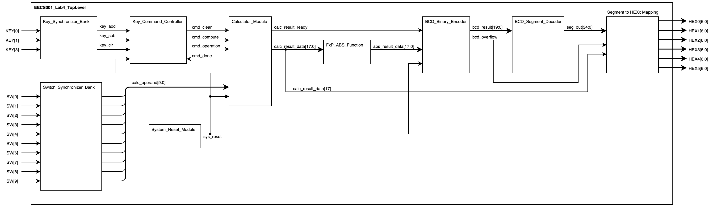

:information_source: This may seem like a lot of logic but remember this design still only uses 1% of the FPGA's available resources.  Real designs are far more complicated.

### Module Hierarchy

* `EECS301_Lab4_TopLevel`
	* `System_Reset_Module`
	* `Key_Synchronizer_Bank`
		* `Key_Synchronizer_Module`
			* `CDC_Input_Synchronizer`
	* `Switch_Synchronizer_Bank`
		* `Switch_Synchronizer_Module`
			* `CDC_Input_Synchronizer`
	* `Key_Command_Controller`
	* `Calculator_Module`
		* `Calculator_Full_Adder`
	* `BCD_Binary_Encoder`
	* `	BCD_Segment_Decoder`
	
### Development Board Hardware

This project utilizes the Seven-Segment LED Display, three Push Buttons, all ten Status LEDs and all ten Slider Switches from the development board.

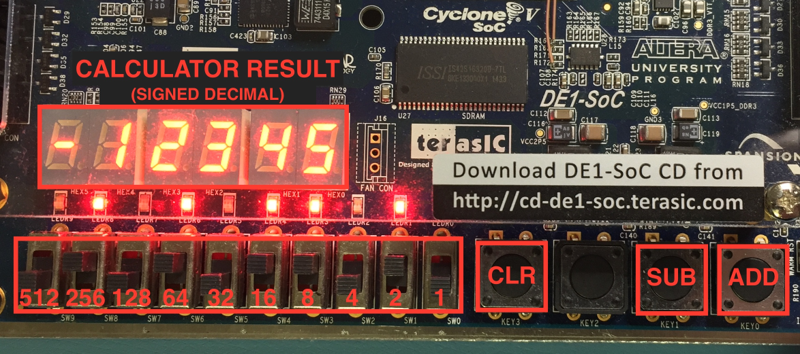

* The Slider Switches set a 10-bit unsigned binary number.
* The Status LEDs show the value of each Switch setting (Off = 0, On = 1).
* The Seven-Segment Display reports the result in signed decimal format.
* The Push Buttons generate the Calculator commands for Add, Subtract, and Clear.

### Reused/Refactored Modules

These modules, reused from the previous lab, have been included with the framework (to save you time) so you won't need to copy them for this lab.

* **Key\_Synchronizer\_Module** (`Key_Synchronizer_Module.v`)

	Reused with small modification to clear the lockout counter if the key is released.  This makes the keys more responsive to multiple presses.
	
* **Switch\_Synchronizer\_Module** (`Switch_Synchronizer_Module.v`)

	Reused without modification.
	
* **CDC\_Input\_Synchronizer** (`CDC_Input_Synchronizer.v`)

	Reused without modification.
	
* **Key\_Synchronizer\_Bank** (`Key_Synchronizer_Bank.v`)

	The `Key_Synchronizer_Bank` module encapsulates the generate logic used in the previous lab to instantiate the `Key_Synchronizer_Module` modules for the Push Button inputs.
	
	Moving common logic like this to its own module makes reusability easier and leaves less code clutter at the top level (both good practices for writing reliable code).

* **Switch\_Synchronizer\_Bank** (`Switch_Synchronizer_Bank.v`)

	The `Switch_Synchronizer_Bank` module encapsulates the generate logic used in the previous lab to instantiate the `Switch_Debounce_Synchronizer` modules for the Slider Switch input.  


### Provided Framework

* **EECS301\_Lab4\_TopLevel** (`EECS301_Lab4_TopLevel.v`)

	This is the Top Level module for the design.  The module instantiates the modules shown in the System Architecture diagram.  The complete implementation is provided so you won't need to modify this file.

* **System\_Reset\_Module** (`System_Reset_Module.v`)

	The `System_Reset_Module` implements an _asynchronous assert / synchronous release_ mechanism for the Reset signal output.  
	
	The **asynchronous assert** means that the Reset signal will immediately assert whenever the `PLL_LOCKED` signal goes low, regardless of the system clock.  This could create metastable events but, since the whole system is being shutdown anyway, it most likely doesn't matter.
	
	The **synchronous release** is very important, especially when resetting State Machine logic.  An asynchronous release would most likely cause metastable events to occur intermittently when the Reset is released.  The synchronous release happens in conjunction with the system clock so the timing can be validated and metastable events prevented.
	
	For a State Machine, a metastable event occurring on the State registers could put the State Machine into an undefined state, which is very bad.  State Machines should always be reset using the synchronous release mechanism.  By releasing the State registers on a clock edge, the Reset signal should reach each register within the defined timing window, which can be verified by the compiler using proper timing constraints.
	
	The `System_Reset_Module` has a few parameterized features making it flexible for multiple uses.
	
	* A Power-On Delay can be specified so the Reset signal will be asserted for the time specified after the `PLL_LOCKED` signal goes high.  The `POWER_ON_DELAY` parameter is set in nanoseconds.  If set to 0, the timer logic will not be instantiated and no delay will occur.
	* The `PLL_LOCKED` signal can be used in conjunction with the clock PLLs provided in the FPGA.  The PLL has a locked signal which indicates the PLL clock output has stabilized.  This locked signal can be connected to the `PLL_LOCKED` input so the Reset will wait until the PLL is locked before releasing the Reset.

	The full `System_Reset_Module` code has been provided with the framework.  The module is slightly complicated but review the module for examples using conditional generate, synchronization chains, and register resets.

* **Key\_Command\_Controller** (`Key_Command_Controller.v`)

	The Key Command Controller monitors the Push Button input events and issues commands to the Calculator using a State Machine to manage the key press tracking.

	See the [Key Command Controller](#red_circle-key-command-controller) implementation section for more details.
		
* **Calculator\_Module** (`Calculator_Module.v`)

	The Calculator Module maintains an accumulator register with the current value shown on the display.  The Calculator takes commands to add to, subtract from, or clear the accumulator register.  The Calculator uses a State Machine to process commands and update the accumulator value.

	See the [Calculator Module](#red_circle-calculator-module) implementation section for more details.

* **FxP\_ABS\_Function** (`FxP_ABS_Function.v`)
	
	The `FxP_ABS_Function` takes a signed fixed point value and outputs the absolute value, which is required since the accumulator value can be negative but the BCD Binary Encoder is expecting positive numbers only.

	Review the module code and you'll see the function is quite simple.  The main reason for modularizing the function is to add it to a library of [Fixed Point](https://en.wikipedia.org/wiki/Fixed-point_arithmetic) operations to reuse later on.
	
	:information_source: When dealing with [Two's Complement](https://en.wikipedia.org/wiki/Two%27s_complement) numbers the following identity is quite useful: `A - B = A + ~B + 1`.

* **BCD\_Binary\_Encoder** (`BCD_Binary_Encoder.v`)

	The BCD Binary Encoder will convert the positive fixed point value into [Binary Coded Decimal (BCD)](https://en.wikipedia.org/wiki/Binary-coded_decimal) format using a State Machine to perform the [Double Dabble](https://en.wikipedia.org/wiki/Double_dabble) conversion algorithm.

	See the [BCD Binary Encoder](#red_circle-bcd-binary-encoder) implementation section for more details.
	
* **BCD\_Segment\_Decoder** (`BCD_Segment_Decoder.v`)

	The BCD Segment Decoder module will convert a BCD encoded value into the Seven Segment display pattern representing the decimal digit.

	See the [BCD Segment Decoder](#red_circle-bcd-segment-decoder) implementation section for more details

* **Standard Functions Include File** (`StdFunctions.vh`)

	This is a Verilog Include File which can be used to share common code among different modules.  In this case, a helper function `bit_index()` is provided to simplify the calculation of the timer parameters.

* **Project Assignments File** (`Lab4_Project_Assignments.qsf`)

	This file contains the pin assignments and some other assignment settings for the design.  The file must be imported during the Quartus Project creation.
	
* **Timing Constraints File** (`EECS301_Lab4_Project.sdc`)

	This file specifies the timing constraint goals, for every signal, the synthesizer will use when compiling the design.  Applying proper timing constrains is a crucial part of FPGA development.  This topic will be discussed in more detail in later labs.  For now, the timing constrains have been provided for this project.

### Known Warning Messages

The following warning messages generated by the project can be safely ignored.  

One Key input (`KEY[2]`) and four of the Segment LEDs (`HEX5[0]`, `HEX5[3]`, `HEX5[4]`, and `HEX[5]`) are unused by the design.

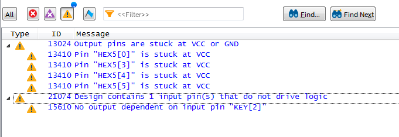

---

## Lab Implementation Requirements

The following section details the implementation requirements for the lab assignment, broken down by module.

**NOTE:** Some of the modules have a lot of background information provided to explain how and why the code is structured as it is.  It's a good idea to read over the material first before getting bogged down in coding specifics.

### Implementation Reference List

For quick reference, here's the list of modules that require development effort:

* [BCD\_Segment\_Decoder](#red_circle-bcd-segment-decoder)
* [Key\_Command\_Controller](#red_circle-key-command-controller)
* [Calculator\_Module](#red_circle-calculator-module)
* [BCD\_Binary\_Encoder](#red_circle-bcd-binary-encoder)


### :red_circle: BCD Segment Decoder

The lab framework includes a starter file for the `BCD_Segment_Decoder` module providing the module declaration and output register initialization.  The remainder of the implementation is required. 

#### Theory of Operation

The `BCD_Segment_Decoder` module converts a BCD value into the Seven Segment display pattern representing the decimal digit.  The implementation uses design concepts from the previous lab.

For maximum reuse and flexibility, the module will be parametrized to accept any number of BCD encoded values.  This is slightly complicated in Verilog due to the lack of an array type for port signals.  To overcome this problem, a _packed array_ will be used instead.  A packed array is basically a single vector with all the array elements concatenated together. See the [HDL Component Reference](Lab4-ComponentReference.md#packed-arrays) for more details.

Each BCD encoded input value is 4-bits and the corresponding Segment output is 7-bits.  The packed array width for each input or output will be the number of BCD digits multiplied by either 4 or 7 respectively.  The following diagram and code snippets demonstrate how the parameterization and array mapping work.

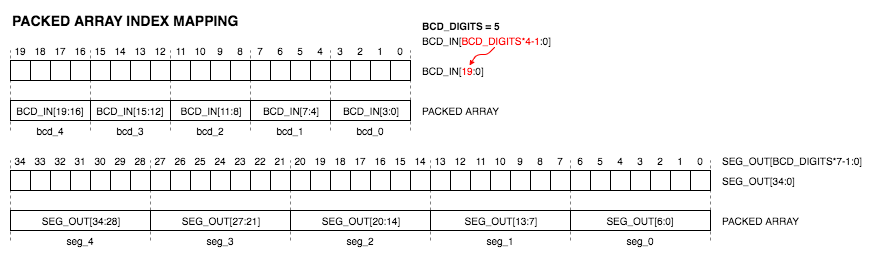

Module definition example using packed arrays.

```verilog
module BCD_Example
#(
	parameter BCD_DIGITS = 5
)
(
	input  [BCD_DIGITS*4-1:0] BCD_IN,  // BCD Input (Packed Array)
	output [BCD_DIGITS*7-1:0] SEG_OUT  // Segment Output (Packed Array)
);
```

Packed arrays can be assigned and read using either vector indexing (shown in the above diagram) or using the concatenation operator, as shown below. 

```verilog
wire [3:0] bcd_0, bcd_1, bcd_2, bcd_3, bcd_4;
wire [6:0] seg_0, seg_1, seg_2, seg_3, seg_4;

// Packing the Array
assign BCD_IN = { bcd_4, bcd_3, bcd_2, bcd_1, bcd_0 };

// Unpacking the Array
assign { seg_4, seg_3, seg_2, seg_1, seg_0 } = SEG_OUT;
```

Concatenation works when the array number is fixed but if the number is variable then the packed array will have to be sectioned using vector indexing.  The following example demonstrates how to unpack and use `BCD_IN` when the number of array elements is set by a parameter.  

```verilog
genvar i;
generate 
begin
	for (i=0; i < BCD_DIGITS; i=i+1)
	begin : bcd_to_seg_mapping
	
		// Registered Multiplexer for each BCD Digit
		always @(posedge CLK)
		begin
			case (BCD_IN[i*4 +: 4])
				default: SEG_OUT[i*7 +: 7] <= 7'b0000000; // Blank
			endcase
		end	
		
	end
end
```

As the _for_ loop variable `i` increments, the vector indexes `BCD_IN[i*4 +: 4]` and `SEG_OUT[i*7 +: 7]` will point to each 4-bit BCD input and each 7-bit output Segment in the packed arrays, as shown in the mapping diagram above.  

**NOTE:** Verilog has three different indexing mechanisms that can be used to section a vector.  See the [Bus Vector Sections](HDL-ReferenceGuide.md#bus-vector-sections) in the HDL Components Reference for more details.

#### BCD to Seven Segment Mapping

The following image shows the top level FPGA signal mapping used by each Seven Segment display on the DE1-SoC Development Board.

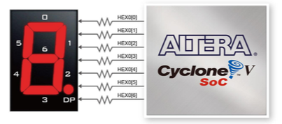

The following table shows Seven Segment output pattern for each BCD input value.

| BCD Input | Digit | Segment Pattern [6:0] | Display |
|:---------:|:-------:|:---------------:|:--:|
| 0000 |   0   | 0111111 |  |
| 0001 |   1   | 0000110 |  |
| 0010 |   2   | 1011011 |  |
| 0011 |   3   | 1001111 |  |
| 0100 |   4   | 1100110 |  |
| 0101 |   5   | 1101101 |  |
| 0110 |   6   | 1111101 |  |
| 0111 |   7   | 0000111 |  |
| 1000 |   8   | 1111111 |  |
| 1001 |   9   | 1100111 |  |
| 1010 | Blank | 0000000 |  |
| 1011 | Blank | 0000000 |  |
| 1100 | Blank | 0000000 |  |
| 1101 | Blank | 0000000 |  |
| 1110 | Blank | 0000000 |  |
| 1111 | Blank | 0000000 |  |

#### Implementation Steps:

1. Open the starter file for the `BCD_Segment_Decoder` module included with the lab framework.

1. The BCD to Seven Segment mapping for a single digit can be done with a [Registered Multiplexer](HDL-ReferenceGuide.md#registered-multiplexer), using the values from the above table list.

	To simplify the code, take advantage of the **default** _case_ statement option to reduce the multiple **Blank** values into a single line.  The syntax would be:
	
	```verilog
	default : SEG_OUT[i*7 +: 7] <= 7'b0000000; // Blank
	```

1. Once you have a single BCD decoder process implemented, replicate the decoder using a generate block _for_ loop to duplicate the registered multiplexer process for each digit specified by the `BCD_DIGITS` parameter.  
	
	The indexing into the packed arrays must take into account the 4 or 7 bits per data element in the arrays.  The indexing can be easier using the alternative Verilog vector indexing format `[LSB +: WIDTH]` which selects `WIDTH` number of bits counting up from the starting position `LSB`.  For example, the first BCD digital would be `BCD_IN[0 +: 4]`, the second would be `BCD_IN[4 +: 4]`, the third would be `BCD_IN[8 +: 4]`, and so on. The [HDL Component Reference](Lab4-ComponentReference.md#packed-arrays) provides a more detailed example.

1. A simulation test bench for this module, [BCD Segment Decoder Test Bench](#bcd-segment-decoder-test-bench), has been included with the framework.  The test bench includes an automated verification routine that will check the Segment output for every possible BCD input value.  Make sure to look at the ModelSim Transcript log for the Pass/Fail messages.


### :red_circle: Key Command Controller

The full `Key_Command_Controller` module implementation has been included with the framework as an example.  No implementation steps are required for the module but a detailed description of the controller State Machine will be given here to provide a better understanding of how State Machines are structured.

If you haven't already, review the [State Machine Guide](Lab4-StateMachineGuide.md) for the basics of State Machine design.

#### Theory of Operation

The **Key Command Controller** monitors the Push Button events and generates commands for the Calculator Module.  There are two commands that can be sent to the Calculator Module: CLEAR and COMPUTE.  The CLEAR command is issued when the CLR Push Button (`KEY[3]`) is pressed.  The COMPUTE command is issued when either the ADD or SUB Push Buttons (`KEY[0]` and `KEY[1]`) are pressed.  The Command Operation value is set for the COMPUTE command to specify either the addition or subtraction operation.  After a command is issued, the Controller waits until the command finishes before accepting any other key events. 

#### State Machine Overview

The following State Diagram describes the **Key Command Controller** State Machine behavior.  The diagram uses [State Chart](https://en.wikipedia.org/wiki/State_diagram#Harel_statechart) notation to describe the **State Transitions** and **State Actions** of the State Machine.

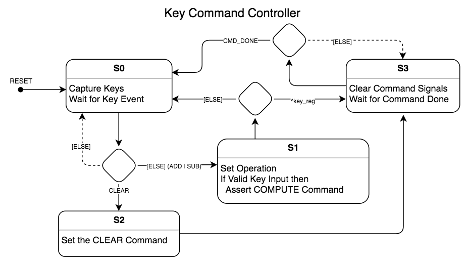

**NOTE:** State Charts are part of [Unified Modeling Language (UML)](https://en.wikipedia.org/wiki/Unified_Modeling_Language) which is widely used in industry for System Architecture models.

Things to note about the State Diagram:

* The State Machine is comprised of four States, labeled **S0**, **S1**, **S2**, and **S3**.
* The **State Actions** are briefly described in the section underneath the State label.  For this diagram, these are general descriptions for simplicity, but in a more detailed diagram these could be the actual code implementation for the actions.
* The arrows connecting the State boxes are the **State Transitions**.
* The diamond box is a conditional branch meaning there are multiple choices for which State will be transitioned to next.  The implementation for conditional branches are usually an _if_ statement or a _case_ statement.  
* The conditional logic is labeled on the transition arrows for the branch options.  Arrows with the `[ELSE]` tag are the secondary choice when setting condition priority.  
* The dashed transition lines are special cases where, if none of the other conditions are met, no transition occurs.


#### Implementation Overview

The implementation for the `Key_Command_Controller` module is provided so you can refer to the actual code while reading through this overview.

:information_source: As you read the State descriptions below, also look at the actual code in the `Key_Command_Controller` module.  Especially, taking note of the syntax used and the overall code structure for the State Machine.

The `State` variable declaration defines a 4-state **one-hot** encoded State Machine.  For more details about the state variable encoding see the [State Machine Guide](Lab4-StateMachineGuide.md#state-variable-definition).

```verilog
reg [3:0] State;
localparam [3:0]
	S0 = 4'b0001,
	S1 = 4'b0010,
	S2 = 4'b0100,
	S3 = 4'b1000;
```

The State Machine uses the standard _Combined Single Process_ structure described in the [State Machine Guide](Lab4-StateMachineGuide.md#process-block).  From the process block sensitivity list, we can tell the State Machine is reset when the `RESET` signal is high and operates on the rising-edge of the `CLK` clock signal.

```verilog
always @(posedge CLK, posedge RESET)
begin
	. . .
end
```

The following overview describes each state of the controller.  Review the code to see how each piece is implemented.  You'll need to reuse these implementation techniques for the other State Machines in the lab assignment.

* **Reset**

	On Reset, the State register is set to **S0** and all registers assigned by the process are set to default values.
	
	Any signal assigned by the State Machine process should be assigned a Reset value.  This will be used by the compiler in lieu of an initial block to set the starting value.

* **State S0**

	This is the Idle State.  
	
	The **Add** and **Sub** key status are stored in the `key_reg` register to be used to set the operation in state **S1**.  The register value updates every clock cycle while the **S0** state is active.  When the transition to **S1** occurs the value that caused the transition will be stored in the register. 
	
	The State Machine will wait for a Key event to occur.  When the **Clear** key is pressed, the State will transition to **S2**.  When either the **Add** or **Sub** keys are pressed, the State will transition to **S1**.  The **Clear** key has priority over the other keys if they are pressed at the same time.
	
	It is important that the transition priority is explicitly stated.  If left up to the compiler, the order could change between compiles which may cause the design to work on some compiles and fail on others.  This is **not** an easy bug to track down so always double-check the priorities, otherwise good luck finding that intermittent failure when it's crunch-time.
	
	* **State Actions:** Capture the `KEY_ADD` and `KEY_SUB` inputs status in the `key_reg` register.
	
	* **State Transitions:** If `KEY_CLEAR` asserts, transition to state **S2**. Else, if `KEY_ADD` or `KEY_SUB` assert, transition to state **S1**.  

		Note, the `KEY_CLEAR` input has priority over the `KEY_ADD` or `KEY_SUB` inputs.  
		
		Note, if neither transition condition is true, then the State will remain at **S0**.  The State variable does not need to be explicitly set to **S0** again because it already is **S0**.

* **State S1**

	Set the Operation and start the Compute Command.
	
	* **State Actions:** 

		* Command Operation, `CMD_OPERATION`, is set to either Add or Subtract depending on the `key_reg` value.

		* The `CMD_COMPUTE` signal is only set if the `key_reg` value is valid, which in this case means that there is only one key pressed.  This is determined by XOR'ing the two Key values together.  If both or neither Keys are pressed then the Compute Command will not be run.
			
	* **State Transitions:** If the `key_reg` value is valid (determined using the same XOR function), transition to state **S3**, else transition to state **S0**.  

* **State S2**

	Start the Clear Command.

	* **Action:** Assert the `CMD_CLEAR` control signal.
	
	* **Transition:** Automatically transition to state **S3**.

* **State S3**
	
	Clear the pulsed control signals and wait for the Command Done signal.

	* **Action:** Clear the `CMD_CLEAR` and `CMD_COMPUTE` signals.

		Note, many pulsed control signals like these will only remain high for one clock cycle.

	* **Transition:** Wait for `CMD_DONE` to assert then transition to state **S0**.

That completes the State Machine overview.  Refer back to this State Machine for help when implementing the other State Machines.


### :red_circle: Calculator Module

A guided walk-through will be given for the `Calculator_Module` module.  The walk-through details each step of building the State Machine starting from scratch.  The code needed for each step is provided so you can focus on the State Machine structure and how the parts go together.  The framework includes a starter file to begin the walk-through with.

#### Theory of Operation

The Calculator Module maintains an accumulator register which can be added to, subtracted from, or cleared.

The `CLEAR` command will clear the accumulator register.  

The `COMPUTE` command will either add or subtract, depending on the `OPERATION` selection, the `CALC_DATA` value to/from the accumulator register.

The `CALC_DATA` input is an unsigned value, 10-bits wide by default.

The `RESULT_DATA` output is signed two's complement value, 18-bits wide by default.

The `RESULT_READY` signal is pulsed when the `RESULT_DATA` output changes to indicate an update has occurred.

#### State Machine Overview

The following State diagram shows the State Transitions and briefly describes the State Actions.

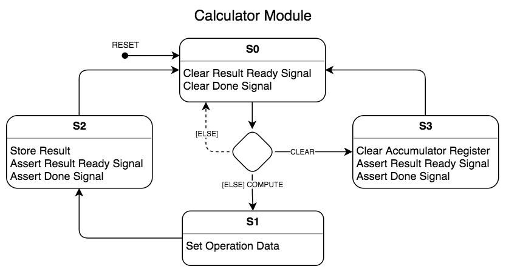

#### Implementation Walk-through

**NOTE:** The code snippets provided below can be copy-and-pasted into the framework code to prevent typos.  Be sure to read through the code being copied to gain a better understanding of how the State Machine works.

1. Create the State register definition for a 4-state State Machine.  The register and parameter definition needs to go before your State Machine process block.

	Copy this code to the module:
	
	```verilog
	reg [3:0] State;
	localparam [3:0]
		S0 = 4'b0001,
		S1 = 4'b0010,
		S2 = 4'b0100,
		S3 = 4'b1000;
	```

2. Create the State Machine skeleton for a 4-state State Machine.  

	The process block must always have a Clock signal and should always have a Reset signal.  Both signals must be aligned to an edge, either positive (`posedge`) or negative (`negedge`), depending on the design requirements.

	Do not define any logic in the process block outside the Reset _if-else_ statement. Likewise, in the _else_ block, do not define any logic outside the _case_ statement.  Both of these cases are bad coding practices for State Machines that will eventually lead to problems.  Logic outside of the main State Machine structure could cause the compiler to interpret the logic incorrectly.
	
	:information_source: When creating a State Machine, start by making an empty State Machine skeleton before adding in State logic.  Getting the structural pieces out of the way first makes it easier to focus on the State logic and makes sure parts are not forgotten.

	Copy this code to the module:
	
	```verilog
	always @(posedge CLK, posedge RESET)
	begin
	
		if (RESET)
		begin
		
		
		end
		else
		begin
		
			case (State)
			
				S0 :
				begin
	
				end
				
				S1 :
				begin
				
				end
				
				S2 :
				begin
				
				end
				
				S3 :
				begin
				
				end
				
			endcase
			
		end
		
	end
	```
	
1. State Machine **Reset**.

	The Reset assignments initialize the State Machine to the starting condition.

	The State variable `State` must always be set to the idle condition (preferably **S0**).

	Any signals assigned by the State Machine must be assigned a Reset value.  Note, there are exceptions to this rule for optimization but for now Reset everything.
	
	Make sure to always assign signals using the correct widths for constants.  This will eliminate compiler warnings and, in some cases, could prevent errors from happening due to missing reset values.
	
	When setting variable width signals to zero, use the width parameter with the replication construct to insure the entire register is reset. For example: `accumulator_reg <= {RESULT_WIDTH{1'b0}}`.
	
	Copy this code to the module for the Reset assignments:

	```verilog
	DONE <= 1'b0;
	RESULT_READY <= 1'b0;
	
	oper_cin <= 1'b0;
	oper_bin <= {RESULT_WIDTH{1'b0}};
	accumulator_reg <= {RESULT_WIDTH{1'b0}};
	
	State <= S0;
	```
	
4. State **S0**.

	* **State Actions:**
	
		Clear the Result Ready signal (`RESULT_READY`).
		
		Clear the Done signal (`DONE`).
		
	* **State Transitions:** 

		If `CLEAR` asserts, transition to state **S3**. Else, if `COMPUTE` asserts, transition to state **S1**.
		
		If neither of these signals are asserted then the State remains as **S0**, no change.  This is implied by not having a final _else_ condition.

	Copy this code to the module for the **S0** state:

	```verilog
	// Clear Result Ready Signal
	RESULT_READY <= 1'b0;
	
	// Clear Done Signal
	DONE <= 1'b0;
	
	// Wait for Compute Start
	if (CLEAR)
		State <= S3;
	else if (COMPUTE)
		State <= S1;
	```
	
4. State **S1**.

	* **State Actions:**

		Set the Operation Data depending on the Operation selection (`OPERATION`).  The Operation Data consists of the data value (`oper_bin`) and the carry-in value (`oper_cin`).
		
		The same adder is used for both operations.  Subtraction is done using the identity `A - B = A + ~B + 1` so the input data needs to be adjusted depending on the Operation. 
		
		When Adding, the adder input B (`oper_bin`) is set to the Extended Calc Data (`calc_data_ext`) value and the adder carry-in (`oper_cin`) is set to 0.
		
		When Subtracting, the adder input B (`oper_bin`) is set to the inverted Extended Calc Data (`~calc_data_ext`) value and the adder carry-in (`oper_cin`) is set to 1.
				
		The following table summarizes the logic:
		
		| Operation | `OPERATION` |  Formula   | `oper_cin` |    `oper_bin`     |
		|:---------:|:-----------:|------------|:----------:|:-----------------:|
		|    Add    |     1'b0    | A +  B + 0 |    1'b0    |  `calc_data_ext`  |
		|    Sub    |     1'b1    | A + ~B + 1 |    1'b1    |  `~calc_data_ext` |


	* **State Transitions:** 

		Automatically transition to **S2**.
		
	Copy this code to the module for the **S1** state:

	```verilog
	// Set the operation data
	case (OPERATION)
		1'b0 : { oper_cin, oper_bin } <= { 1'b0,  calc_data_ext }; // Add
		1'b1 : { oper_cin, oper_bin } <= { 1'b1, ~calc_data_ext }; // Sub
	endcase
	
	State <= S2;
	```
	
4. State **S2**.

	* **State Actions:**

		Load the Accumulator Register (`accumulator_reg`) with the output from the Adder (`adder_result`).
		
		Assert the Result Ready signal.
		
		Assert the Done signal.
		
	* **State Transitions:** 

		Automatically transition to **S0**.

	Copy this code to the module for the **S2** state:

	```verilog
	// Store the result
	accumulator_reg <= adder_result;
	
	// Assert Result Ready
	RESULT_READY <= 1'b1;
	
	// Command Done
	DONE <= 1'b1;
	
	State <= S0;	
	```
	
4. State **S3**.

	* **State Actions:**

		Clear the Accumulator Register (`accumulator_reg`).
		
		Assert the Result Ready signal.
		
		Assert the Done signal.
		
	* **State Transitions:** 

		Automatically transition to **S0**.

	Copy this code to the module for the **S3** state:

	```verilog
	// Clear accumulator register
	accumulator_reg <= {RESULT_WIDTH{1'b0}};
	
	// Assert Result Ready
	RESULT_READY <= 1'b1;
	
	// Command Done
	DONE <= 1'b1;
	
	State <= S0;
	```
	
That completes the State Machine walk-through.  You should have a good understanding of the overall State Machine process structure (maybe not the State logic design yet but that will be covered later).  Refer back to the empty State Machine skeleton when creating new State Machines. 


### :red_circle: BCD Binary Encoder

The `BCD_Binary_Encoder` module contains the final State Machine for the lab.  The implementation for this State Machine must be completed using what was learned from the previous two examples. The State Machines are similar so refer back to those for help.

The lab framework includes a starter file for the `BCD_Binary_Encoder` module with some support pieces completed.  The BCD conversion process requires specialized adders, called BCD Column Adders, that have been provided for you in the module.

#### Theory of Operation

The `BCD_Binary_Encoder` module converts an unsigned binary input value into [Binary Coded Decimal (BCD)](https://en.wikipedia.org/wiki/Binary-coded_decimal)  digits using the Binary to BCD [Double Dabble](https://en.wikipedia.org/wiki/Double_dabble) algorithm.  (Note, this is a variation of the same binary to decimal method demonstrated in class.)

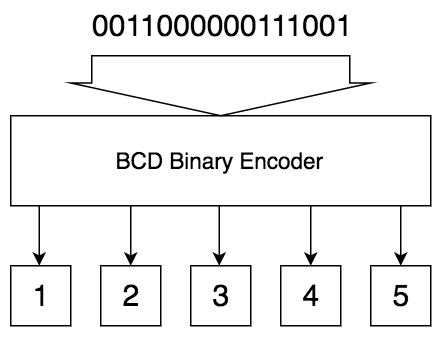

The BCD Binary Encoder module uses a State Machine to convert the binary value into BCD format using the [Double Dabble](https://en.wikipedia.org/wiki/Double_dabble) algorithm.

The algorithm uses two shift registers, the Binary Shift Register and the BCD Shift Register, to sequentially process the input data one bit at a time.  The first step of the process loads the binary input value into the Binary Shift Register and clears the BCD Shift Register.  Next both shift registers shift the data to the left with the MSB data from the Binary Shift Register flowing into the LSB of the BCD Shift Register.  After the shift, the BCD data is run though a specialized adder to adjust the BCD columns.  If the BCD column value is greater than 4 then 3 is added to the value.  The data is stored back into the BCD Shift Register and the next shift cycle is preformed.  One shift cycle is preformed per bit of the binary input.  The process completes when all data has been shifted from the Binary Shift Register to the BCD Shift Register.  The data remaining in the BCD Shift Register is the BCD converted output.

An example of the shifting process is shown in the following table. 

```
10^4 10^3 10^2 10^1 10^0    Original binary
0000 0000 0000 0000 0000   0011000000111001   Initialization (16'h3039)
0000 0000 0000 0000 0000   0110000001110010   Shift left (1st)
0000 0000 0000 0000 0000   1100000011100100   Shift left (2nd)
0000 0000 0000 0000 0001   1000000111001000   Shift left (3rd)
0000 0000 0000 0000 0011   0000001110010000   Shift left (4th)
0000 0000 0000 0000 0110   0000011100100000   Shift left (5th)
0000 0000 0000 0000 1001   0000011100100000   Add 3 to 10^0 (6 => 9)
0000 0000 0000 0001 0010   0000111001000000   Shift left (6th)
0000 0000 0000 0010 0100   0001110010000000   Shift left (7th)
0000 0000 0000 0100 1000   0011100100000000   Shift left (8th)
0000 0000 0000 0100 1011   0011100100000000   Add 3 to 10^0 (8 => 11)
0000 0000 0000 1001 0110   0111001000000000   Shift left (9th)
0000 0000 0000 1100 1001   0111001000000000   Add 3 to 10^0 and 10^1 (6 => 9, 9 => 12)
0000 0000 0001 1001 0010   1110010000000000   Shift left (10th)
0000 0000 0001 1100 0010   1110010000000000   Add 3 to 10^1 (9 => 12)
0000 0000 0011 1000 0101   1100100000000000   Shift left (11th)
0000 0000 0011 1011 1000   1100100000000000   Add 3 to 10^0 and 10^1 (5 => 8, 8 => 11)
0000 0000 0111 0111 0001   1001000000000000   Shift left (12th)
0000 0000 1010 1010 0001   1001000000000000   Add 3 to 10^1 and 10^2 (7 => 10, 7 => 10)
0000 0001 0101 0100 0011   0010000000000000   Shift left (13th)
0000 0001 1000 0100 0011   0010000000000000   Add 3 to 10^2 (5 => 8)
0000 0011 0000 1000 0110   0100000000000000   Shift left (14th)
0000 0011 0000 1011 1001   0100000000000000   Add 3 to 10^0 and 10^1 (6 => 9, 8 => 11)
0000 0110 0001 0111 0010   1000000000000000   Shift left (15th)
0000 1001 0001 1010 0010   1000000000000000   Add 3 to 10^1 and 10^3 (7 => 10, 6 => 9)
0001 0010 0011 0100 0101   0000000000000000   Shift left (16th)
                                              *No adding after final shift.
  1    2    3    4    5
           BCD
```

After each shift, the BCD Shift Register data must be analyzed and any BCD digit over the value 4 needs to be incremented by 3. During normal operation the BCD input value should never be 10 or higher so the Adder will output 0 as an error in those cases.  

The **BCD Column Adders** do both the analysis and the selective adding of the BCD digits in a single step using a multiplexer with the following logic table.

| BCD Value | BCD Adder Output |  Operation  |
|:---------:|:----------------:|:-----------:|
|  4'b0000  |     4'b0000      |    None     |
|  4'b0001  |     4'b0001      |    None     |
|  4'b0010  |     4'b0010      |    None     |
|  4'b0011  |     4'b0011      |    None     |
|  4'b0100  |     4'b0100      |    None     |
|  4'b0101  |     4'b1000      |    Add 3    |
|  4'b0110  |     4'b1001      |    Add 3    |
|  4'b0111  |     4'b1010      |    Add 3    |
|  4'b1000  |     4'b1011      |    Add 3    |
|  4'b1001  |     4'b1100      |    Add 3    |
|  4'b1010  |     4'b0000      | Invalid Input |
|  4'b1011  |     4'b0000      | Invalid Input |
|  4'b1100  |     4'b0000      | Invalid Input |
|  4'b1101  |     4'b0000      | Invalid Input |
|  4'b1110  |     4'b0000      | Invalid Input |
|  4'b1111  |     4'b0000      | Invalid Input |

One BCD Column Adder is required per BCD Digit.  The implementation of the BCD Column Adders has been provided with the lab framework.
								
										
#### State Machine Overview

The following State diagram shows the Binary to BCD conversion algorithm used.

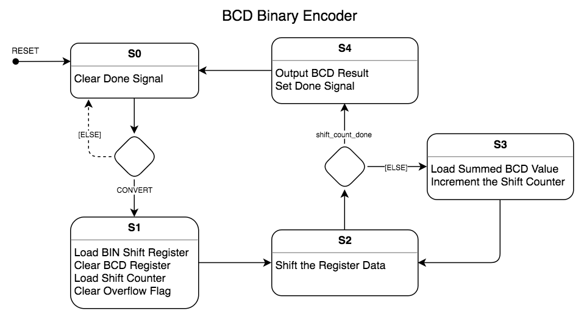

The following overview describes each state of the controller.

* **Reset**

	On Reset, the State register is set to **S0** and all registers assigned by the process are set to default values.

	**NOTE:** The following registers are assigned by the State Machine process so make sure the Reset values are set appropriately.
	
	```
	State
	DONE
	BCD_OUT
	BCD_OVERFLOW
	shift_counter_reg
	bin_shift_reg
	bcd_shift_reg	
	overflow_flag
	```
			
* **State S0**

	This is the Idle State.  The Binary to BCD conversion process is started when the Convert signal asserts.
	
	* **Action:** Clear the `DONE` signal.
	
	* **Transition:** When the `CONVERT` signal asserts, transition to state **S1**.


* **State S1**

	The registers are setup for the conversion.
		
	* **Actions:** 

		* Load the Binary Shift Register (`bin_shift_reg`) with the Binary input data (`BIN_IN`).
		
		* Clear the BCD Shift Register (`bcd_shift_reg`).
		
		* Reload the Shift Counter (`shift_counter_reg`) with the computed load value (`SHIFT_COUNTER_LOADVAL`).
		
		* Clear the Overflow flag (`overflow_flag`).
			
	* **Transition:** Automatically transition to state **S2**.

* **State S2**

	Shift the data registers.

	* **Action:** 

		Shift the data registers.
		
		When the registers shift, the MSB of the Binary Shift Register flows into the LSB of the BCD Shift Register and MSB of the BCD Shift Register flows into the Overflow detector.
			
		The shift register structure is shown in the following diagram.  Note the feedback on the Overflow Register, this OR'd feedback creates a Sticky-Bit that once set stays set for the remainder of the process.  If any 1 bits are shifted out of the BCD Shift Register, the overflow will be set to indicate an error.
		
		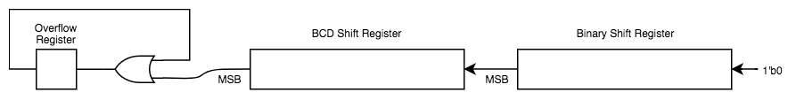
		
		For implementation, use a single concatenation statement for the shift register assignments combining the elements shown in the following table.
		
		|     Register    |  Assignment Value |
		|:---------------:|:------------------|
		| `overflow_flag` | `overflow_flag` &#124; `bcd_shift_reg[BCD_WIDTH-1]` |
		| `bcd_shift_reg` | `{ bcd_shift_reg[BCD_WIDTH-2:0], bin_shift_reg[BIN_WIDTH-1] } ` |
		| `bin_shift_reg` | `{ bin_shift_reg[BIN_WIDTH-2:0], 1'b0 }` |
		
		Note, the `bin_shift_reg` register may not have to be split apart when put into a single statement.
	
	* **Transition:** If `shift_counter_done` is true, transition to state **S4**, otherwise transition to state **S3**.

* **State S3**
	
	Load the Summed BCD values and increment the Shift Counter.

	* **Actions:** 

		* Load the BCD Shift Register (`bcd_shift_reg`) with the value from the BCD Column Adder output (`bcd_adder_sum`).
		
		* Increment the Shift Counter (`shift_counter_reg`).
		
	* **Transition:** Automatically transition to state **S2**.

* **State S4**
	
	Output the BCD Result and assert the Done signal.

	* **Action:** 
	
		* Load the BCD Output (`BCD_OUT`) with the BCD Shift Register (`bcd_shift_reg`) value.

		* Load the BCD Overflow (`BCD_OVERFLOW `) with the Overflow status (`overflow_flag`) value.

		* Assert the Done signal (`DONE`).
				
	* **Transition:** Automatically transition to state **S0**.


#### Implementation Steps:

1. Open the `BCD_Binary_Encoder` module provided with the lab framework.

1. Create the State register definition for a 5-state State Machine.  

	Use one-hot encoding and use the State labels (S0, S1, S2, S3, and S4) as shown in the State diagram.
	
1. Create a State Machine code skeleton for the State Machine.

	NOTE: The skeleton used for the previous State Machine is a good place to start, just add a state.

1. Implement the Reset and State logic using the descriptions provided in the previous **State Machine Overview** section.

1. Verify your State Machine implementation using the simulation Test Bench provided with the lab framework: [BCD Binary Encoder Test Bench](#bcd-binary-encoder-test-bench)

---

## Debugging with Simulation 

These simulation test bench modules have been provided with the framework for you to debug and verify the code implementation.

In the previous two labs, the test benches required manual verification of the simulation results (looking at the simulation waveforms).  These type of manual verification test benches can be referred to as **Functional Check Test Benches** (although that is not a standard name).  Functional Check test benches are mainly used for debugging during development.  They are faster to write but take more effort and expert knowledge to verify that the design is working.

We saw in the first lab an example of a test bench with automated results checking.  This type of test bench is usually referred to as a **Function Verification Test Bench** (although the naming varies).  The automated results checking takes longer to develop but can be used to test far more test cases than a developer can manually check. A Function Verification test bench can also be used for regression testing in later product phases and would not require expert knowledge to simply check the pass/fail test status results.

The two test benches, `TF_BCD_Segment_Decoder` and `TF_BCD_Binary_Encoder`, used in this lab are **Function Verification** test benches which include automated verification of the full range of input possibilities (known as full-coverage testing).

In later labs you will be designing this sort of automated verification function to test the output from a module.  Carefully reviewing the code for these two test benches will help you for that lab.


### BCD Segment Decoder Test Bench

When a module has complicated functionality, providing an individual test bench for that module helps ensure overall design reliability.  A test bench can aid in the initial development testing but can also be used later on for regression testing to insure that other changes to the system do not break the original functionality.

The first step to create a verification test is to generate the test vector sets needed to provide input patterns and the expected output results for those patterns.  These test vectors can be generated algorithmically during the simulation or pulled from a file of pre-computed test patterns.

Next, a test sequence is created for the simulation to apply these test patterns, one at a time, to the module being tested and compare the module output to the expected results.  If the results match then the test passes, if not then a failure is logged.  That's the basic concept but actually creating the test pattern and expected result pairs for every possible input combination (aka full coverage) can be challenging.

The `TF_BCD_Segment_Decoder` test bench instantiates a `BCD_Segment_Decoder` module with five BCD digits.  An automated test vector generator creates BCD input codes that will test every combination possible to insure full coverage validation (16<sup>5</sup> combinations).  The output for each input test pattern is checked against the expected result.  If the pattern does not match, an error is displayed in the Transcript window.

You'll notice the same clock emulation structure has been reused from previous test benches but in this case the clock rate has been increased to 500 MHz.  This trick can be used to shorten the simulation run time when running behavioral simulations which do not rely on real wall-clock times.  Had we tried this with the PWM controller, which computes delays based on real-times, the counter sizes would have increased to match the faster clock and the simulation time would have remained the same.

For this test bench, the full coverage testing should complete in 7 ms of simulation time, in which time 16<sup>5</sup> tests are run.  The error log will be display in the **Transcript** window showing the pass/fail status for every test.  A summary, showing the total errors, is displayed after the test finishes.

To help with debugging, a handy feature was added to the test bench to make it easier to find where errors occur in the waveform window.  The `test_output_errors` signal will assert anytime an error occurs.  You can zoom in on a failing test and look at the input, output, and internal module signals to debug the problem.


**Test Bench Configuration Steps:**

1. Switch the **Tasks** pulldown to **RTL Simulation** then run **Edit Settings** for the RTL Simulation.

2. Select **Compile test bench** and click on the **Test Benches...** button.

3. Click the **New...** button to create a new test bench.

4. Enter the following information:

	* **Test bench name:** `TF_BCD_Segment_Decoder`
	* **Top level module in test bench:** `TF_BCD_Segment_Decoder`
	* Select **End Simulation at** and set the end time to **1 uS**.
	* Add `TF_BCD_Segment_Decoder.v` to the simulation files list.

	Save the test bench setup.
	
1. Select the test bench from the **Compile test bench** drop-down list.

1. Set the **Simulation Setup Script** to `simulation/modelsim/TF_BCD_Segment_Decoder.do`

**Expected Simulation Results**

Run the simulation for 7 ms.  The expected simulation results are shown below. 

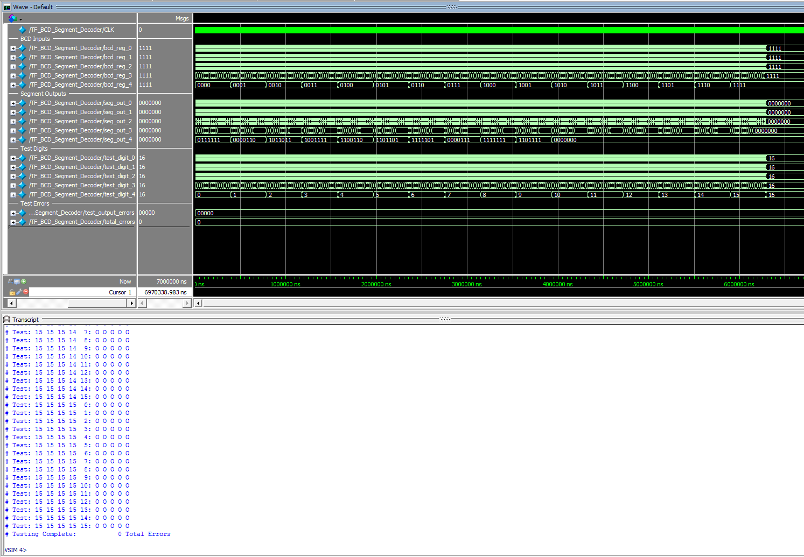


### BCD Binary Encoder Test Bench

The `TF_BCD_Binary_Encoder` test bench uses a similar automated test verification routine as the `TF_BCD_Segment_Decoder` test bench.  The `BCD_Binary_Encoder` module is instantiated with a 17-bit binary input and 5 BCD digit outputs.  Every possible combination for the 17-bit binary input is generated and verified against expected output values.  The testing log is shown in the Transcripts window.

The `error_status` signal can be used to find the exact location of errors in the Waveform window.  Zoom-in anywhere the error status is asserted to debug the error.

:warning: When debugging State Machine designs, pay careful attention to the `State` variable to insure the State transitions are progressing in the proper order.  One commonly seen bug is a missing State Transition assignment.  In this case, the `State` variable will be stuck on the same value and not moving.  This sort of bug is easy to spot in the simulator, as long as you're paying attention to the `State` variable.


**Test Bench Configuration Steps:**

1. Switch the **Tasks** pulldown to **RTL Simulation** then run **Edit Settings** for the RTL Simulation.

2. Select **Compile test bench** and click on the **Test Benches...** button.

3. Click the **New...** button to create a new test bench.

4. Enter the following information:

	* **Test bench name:** `TF_BCD_Binary_Encoder`
	* **Top level module in test bench:** `TF_BCD_Binary_Encoder`
	* Select **End Simulation at** and set the end time to **1 uS**.
	* Add `TF_BCD_Binary_Encoder.v` to the simulation files list.

	Save the test bench setup.
	
1. Select the test bench from the **Compile test bench** drop-down list.

1. Set the **Simulation Setup Script** to `simulation/modelsim/TF_BCD_Binary_Encoder.do`

**Expected Simulation Results**

Run the simulation for 11 ms.  The expected simulation results are shown below. 

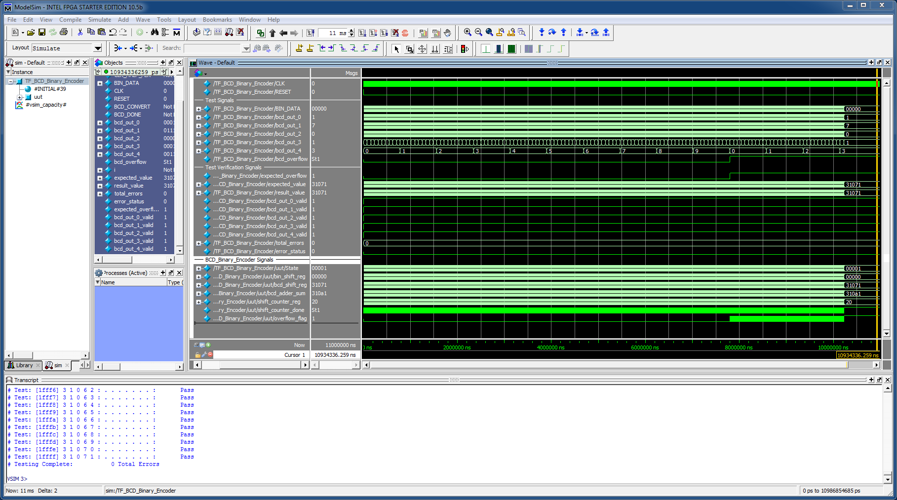


### EECS301 Lab4 Top Level Test Bench

The `TF_EECS301_Lab4_TopLevel` test bench provides a rudimentary test of the complete system.  A number of button presses are simulated and the waveform output can be checked for correct functionality.

**Running this simulation is not required for assignment.**

With most of the code provided by the framework and comprehensive testing done for the modified modules, this simulation isn't really needed.  If you want to play around with some of the simulation techniques demonstrated so far, go ahead and use this simulation as a testbed. Feel free to expand the testing to implement some of the automated verification features used in the other two simulations.

## Load the Design on the Dev Board

After getting the design to compile and verifying the logic with the simulator, the final (or first iteration) step is to load the design on the hardware.

Setting up and loading the design on the hardware development board will be done the same as was done in the previous labs.

For the Lab 4 Project, the programming file in the `output_files` directory will be named `EECS301_Lab4_TopLevel.sof`.

Refer back to the Lab 1 Development Kit Hardware Guide for the full loading process, using the `EECS301_Lab4_TopLevel.sof` file of course.


---

Return to the [Lab 4 Assignment](../README.md) page...
