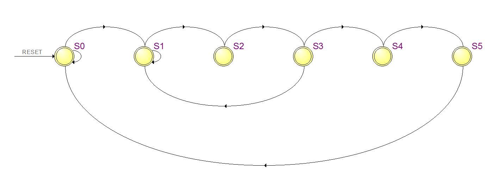
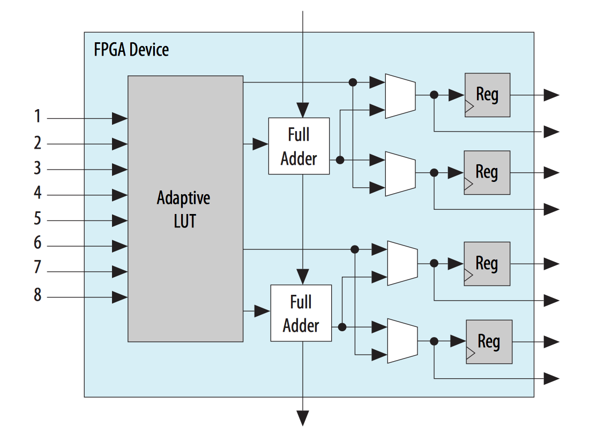

# Lab #4: State Machine Guide

## Overview

State Machines (often referred to as [Finite State Machines](https://en.wikipedia.org/wiki/Finite-state_machine) (FSM)) are a core design concept needed for most FPGA designs.

The field of State Machine design has many differing (and often contradictory) design concepts and implementation techniques.  This guide will focus only on design methods for FPGA State Machine applications.

Control algorithms using the State Machine model allow FPGA designs to manage sequential action flows, provide complex reactive decision-making, and supervise computational data flows.

A State Machine can be modeled simply using a [state diagram](https://en.wikipedia.org/wiki/State_diagram) (as shown below) or could be generated from a complicated modeling system such as [UML](https://en.wikipedia.org/wiki/Unified_Modeling_Language).  Many times, such diagrams are generated by a Systems architect and handed down to the FPGA designer to implement (often without regard to proper FPGA design techniques).  



State Machine models created from a top-down process can easily get out-of-hand quickly. When implementing a State Machine for an FPGA, first take a step back and look to see if the task can be broken down into smaller functional pieces.  Ideally, a State Machine will have between 3 to 6 states to get a task accomplished.  Anything over 10 states should be restructured.

Breaking up a large task into smaller components makes individually testing each component and tracking down bugs easier.  Smaller State Machines working in conjunction on the same task can also take advantage of the parallel nature of the FPGA architecture.

When dealing with large sequential command sets, instead of creating a huge State Machine consider the use of the FPGA's built-in RAM.  A small State Machine can read and execute the sequential operations from a block of RAM far more efficiently.  This will be referred to as a Hybrid State Machine.  A common example of this appears in the SPI controller State Machine used to read data from an ADC or an accelerometer (as will be seen in the next lab).


## FPGA Specific State Machine Issues

In early hardware State Machine designs, [discrete logic gates](https://en.wikipedia.org/wiki/Logic_gate) were used to construct state machine circuits.
At the time, [combinatorial logic](https://en.wikipedia.org/wiki/Combinational_logic) chips (AND, OR, XOR, NOT) were less expensive than [register](https://en.wikipedia.org/wiki/Flip-flop_(electronics)) chips.  Cost concerns pushed state machine designers to focus on reducing register usage by encoding the state variable (typically with binary or gray encoding).  The register reduction trade-off increases the amount of combinatorial logic and the propagation time required to resolve the next state values.

Modern FPGA chips do not suffer from limited register resources, in fact most FPGA family architectures have as many or more registers than combinatorial blocks.  Due to this, many of the state encoding techniques that focus on encoding the state variable do not apply to FPGA design.  Instead, FPGA State Machines primarily use **one-hot** state encoding, as discussed [later](#state-variable-definition).

The FPGA compiler will synthesize HDL code into a netlist of FPGA core components then map those components onto the FPGA fabric of the targeted device.  The compiler will try to place related logic as closely together as possible to reduce the propagation delay between components to meet timing constraints.  Large blocks of intertwined logic (such as large state machines) make it more difficult for the compiler to map logic onto the fabric.  By keeping State Machines compact, the compiler can pack FPGA components more efficiently resulting in faster build times.  

As a general rule, try to reduce individual State Machine logic by focusing each State Machine on one task, then combining the individual tasks to form the larger job.  State Machine interactions occurring across well defined signal interfaces, as defined by the State Machine port list, improve testing and refactorability of the State Machine tasks.

The basic building block of most modern FPGA devices contain a Look-Up-Table (LUT) and at-least one Register.  The **Cyclone V** basic building block is called the **Adaptive Logic Module** (ALM) and contains an **Adaptive LUT** and four **Registers**. 



This FPGA cell structure is particularly advantageous for **one-hot** encoded State Machines since each state has a register which is fed with combinatorial logic.  By minimizing our State Machine tasks, the transition logic required for each State is reduced, ideally to the point of fitting into a single LUT.  When done so, State Machines with very fast clock rates can be achieved.

The wide input of the **Cyclone V's** **Adaptive LUT** makes it even easier for complex transition logic to fit into a single LUT.  These max performance gains can be achieved for real-world useful applications, not just trivial academic examples.


## Good State Machine Design Practices

* Focus each State Machine on a single related task
* Keep the number of states to a minimum
* Break up larger control applications into smaller pieces
* Keep data flow pathways outside the state machine
* Avoid Re-Entry and Exit Actions
* Always use a Reset signal to initialize all output registers
* Input signals should always be synchronous to the State Machine clock
* Never both read and assign a register in the same state action
* Never use the State Machine process block for other logic
* Only assign the State variable using the State parameter definitions
* Never use the State variable as a logic input
* Only one State Machine should exist per HDL Module File


## HDL Implementation Details

There's been a debate for some time as to whether its better to implement state machines in HDL using a **Combined Single Process** or a **Split Two Process** technique.  Advocates usually agree (before devolving into a religious argument) that the resulting hardware generated from either method is equivalent.  

The difference between the two techniques is where the ***State Actions*** and ***State Transitions*** happen.  The **Combined Single Process** keeps the actions and transitions together in the code, where-as the **Split Two Process**  separates the actions into one process and the transitions into another process.

* **State Transitions** determine the next State for each cycle of the State Machine.  These are the combinatorial computations fed into each State register. Transition types can take following forms: Automatic, Conditional, or Branching.

* **State Actions** are the output signals from the State Machine.  These are usually control signals, status signals, or various forms of counter registers.

All of the state machine implementations presented here will follow the **Combined Single Process** model, due mainly to the code maintainability aspect.  When making a code change, it is always better to only have to edit the code in one place, rather than having to insure that two places stay in sync. 


## State Variable Definition

The current state of the State Machine is stored in the **State Variable** register.
For FPGA designs, using [**one-hot**](https://en.wikipedia.org/wiki/One-hot) state encoding should be your first choice.  

**One-hot** encoding requires one register per State Machine state. FPGAs have one or more registers per combinatorial block making one-hot encoding economical.  Dedicating a register per state reduces the combinatorial logic required for state transition computation.  Reducing the combinatorial logic required also reduces the propagation delay which increases the maximum clock rate of the State Machine.

:information_source: Even if you don't intend to run your State Machine at the maximum clock rate, by increasing the maximum rate possible, the compiler will have more flexibility and an easier time placing logic that meets the requested timing constraints. When the compiler struggles to meet the timing constraints on a large design, the build times become excessively long (hours).

The following example shows a Verilog implementation for a 6-state **State Variable** definition:

```Verilog
reg [5:0] State;
localparam [5:0]
	S0 = 6'b000001,
	S1 = 6'b000010,
	S2 = 6'b000100,
	S3 = 6'b001000,
	S4 = 6'b010000,
	S5 = 6'b100000;
```

* The register `State` stores the current state of the State Machine.
* The **parameter** definitions provides the assignment constants for the `State` register.
	* Assignments are made in the form `State <= S0;` 
	* :warning: The `State` variable should **always** be assigned using the **parameter** definitions.  
	* :warning: **Never** use another variable or hard-coded value to set the `State` variable.
	* There are ***no*** clever deviations for the last two rules, just bad code.

:information_source: The compiler has the option to re-encode your parameter definitions if it determines it is more efficient to do so.  Usually this is Ok but be aware it may cause differences between behavioral simulation and the actual hardware.  With Quartus, this can occur when the State Machine encoding is set to **auto** (the default) and the number of states is 4 or less.  Instead of **one-hot** encoding, Quartus may re-encode the State variable with **binary** encoding.

### Quartus One-Hot Encoding

When viewing the State Machine results for the previous example in the Quartus Compilation Report, you may notice an encoding oddity as shown in the following table.

|   Name   | Reg.S5 | Reg.S4 | Reg.S3 | Reg.S2 | Reg.S1 | Reg.S0 |
|:--------:|:--------:|:--------:|:--------:|:--------:|:--------:|:--------:|
| State.S0 | 0 | 0 | 0 | 0 | 0 | 0 |
| State.S1 | 0 | 0 | 0 | 0 | 1 | 1 |
| State.S2 | 0 | 0 | 0 | 1 | 0 | 1 |
| State.S3 | 0 | 0 | 1 | 0 | 0 | 1 |
| State.S4 | 0 | 1 | 0 | 0 | 0 | 1 |
| State.S5 | 1 | 0 | 0 | 0 | 0 | 1 |

In this table, we see the Register values (columns) for each State (rows).  The register values for S0 have been ***inverted*** from the given definition.

Quartus inverts the S0 register logic because the default initial startup register value for all FPGA registers is 0 (unless otherwise specified).  By inverting the S0 state and the associated logic, the state machine will start-up properly even when the designer does not properly assign an initial or reset value for the State variable.

### One-Hot Fault Conditions 

A **one-hot** encoded State variable should only have one active register at any given time.  A [Single Event Upset](https://en.wikipedia.org/wiki/Single_event_upset) could throw the State Machine into an invalid condition.  There are illegal-state detection mechanisms that can be employed to monitor **one-hot** State Machines for mission critical applications.  Those mechanisms are beyond the scope of what is presented here, but following the [Good State Machine Design Practices](#good-state-machine-design-practices) will help reduce the chance and impact of fault conditions. 


## State Machine HDL Module Framework

Next, we'll look at the State Machine HDL Module structure.  For these examples Verilog will be used.

:warning: Each State Machine should have its own module and file.  Never place two State Machines in the same file.  This improves code maintainability, refactorability, and allows simulation unit-testing per State Machine.

### Full State Machine Module Example

The following State Machine uses the **Combined Single Process** format.  The full listing will be presented first, proceeded by a section-by-section detailed review.  Pay close attention to the code formatting and structure.  The coding standard used emphasizes readability to make the code easier to follow and to maintain.

```Verilog
module State_Machine_Module
(
	// Control Signals
	input      START,
	output reg DONE,
	
	// Event Signals
	input      EVENT_READY,
	output reg EVENT_CLEAR,

	// System Signals
	input CLK,
	input RESET
);

	//
	// State Machine Variable Definition
	//
	reg [3:0] State;
	localparam [3:0]
		S0 = 4'b0001,
		S1 = 4'b0010,
		S2 = 4'b0100,
		S3 = 4'b1000;

	//
	// State Machine Process
	//
	always @(posedge CLK, posedge RESET)
	begin
	
		if (RESET)
		begin
		
			// Reset Register Assignments
			DONE <= 1'b0;
			EVENT_CLEAR <= 1'b0;
			
			// Reset State Variable
			State <= S0;
			
		end
		else
		begin
		
			// State Machine Operations (Actions / Transitions)
			case (State)
			
				S0 :  // State 0
				begin
				
					// Clear the Done status
					DONE <= 1'b0;
					
					// Wait for Start
					if (START)
						State <= S1;
						
				end
				
				S1 :  // State 1
				begin
					
					// Wait until Event is Ready
					if (EVENT_READY)
						State <= S2;
					
				end
				
				S2 :  // State 2
				begin
				
					// Set the Event Clear Signal
					EVENT_CLEAR <= 1'b1;
					
					State <= S3;
					
				end
				
				S3 :  // State 3
				begin
				
					// Clear the Event Clear signal
					EVENT_CLEAR <= 1'b0;
					
					// Set the Done status
					DONE <= 1'b1;
					
					State <= S0;
				
				end
				
			endcase
			
		end
			
	end
	
endmodule
```

---

### State Variable Definition

Similar to the earlier [discussion](#state-variable-definition), the `State` register defines a 4-state **one-hot** encoding.

```Verilog
reg [3:0] State;
localparam [3:0]
	S0 = 4'b0001,
	S1 = 4'b0010,
	S2 = 4'b0100,
	S3 = 4'b1000;
```

* **Rule:** Use the naming convention `State` and `Sx` for all State Machines.
	* Usually descriptive variable naming improves code readability, but in the case of the State parameters, `Sx`, this is not true.  The `Sx` naming convention makes it easier to follow the state transition flow through the code.  Each State can be given a descriptive comment in lieu of a descriptive parameter name.
* The register and parameter vector size (`[3:0]` in this example) should always match.
* Use `localparam` for the parameter definitions.
* Use the binary format for the declaring constants: (e.g. `4'b0001`)
	* This format makes it easy to see the diagonal 1's to quickly verify the definition.
	* Remember to use the binary specifier: `b`
	* Remember to specify the correct size: (e.g. `4'`)
	* Note: Each parameter row ends with a `,` except for the last row's `;`
	* If for some (suspect) reason the State Machine has more than 10 states, maintain the vertical alignment on the parameter constants so they're at least readable (by the person fixing the code).

### Process Block

:information_source: The State Machine example is implemented in Verilog, which uses `always @()` for the Process Block. 

**NOTE:** The **Combined Single Process** architecture means there is only one process block for the State Machine.

Writing a State Machine starts with the process block:

```Verilog
always @(posedge CLK, posedge RESET)
begin
...
end
```

* **Sensitivity List**: `@(posedge CLK, posedge RESET)`
	* The sensitivity list for a State Machine will always follow this the same pattern.
	* The State Machine will be clocked on the **rising-edge** of the `CLK` signal. 
	* The State Machine will be reset on the **rising-edge** of the `RESET` signal.
	* The State Machine will be held in Reset while the `RESET` signal is asserted high.

**NOTE:** There are other variations where the State Machine can run on the falling-edge of the clock or be reset with an active-low signal but all of the State Machines for this Lab should be **positive-edge clocked** and **active-high reset**.

:warning: **WARNING:** In addition to the State Machine registers being synchronized to the positive-edge of the clock signal, **ALL** input signals that are read by the State Machine **MUST** be synchronous to the same positive-edge clock signal.  An input signal (especially an input for the **State Transition** logic) that is not synchronized to the State Machine clock will cause [metastability](https://en.wikipedia.org/wiki/Metastability_in_electronics) issues that will most likely cause the State Machine to fail in frustratingly indeterministic ways.

### State Machine Reset 

The State Machine **Reset** is implemented using an if/then statement.  The **Reset** will initialize all output registers written in the State Machine process.  The `RESET` signal can be used to hold the State Machine in reset after power-up or to reset the State Machine anytime during normal operation.  When `RESET` is asserted, all State Machine values return to the initial state. 

```Verilog
if (RESET)
begin
	// Reset Assignments
end
else
begin
	// State Machine Operations
end
```

* The `RESET` signal is active-high
	* The **TRUE** section is for Reset Assignments
	* The **FALSE** section is for State Machine Operations
* All registers set in the State Machine process should have a Reset assignment.
	* These assignments will be used as the Initial register values set by the FPGA Program  Bitstream.
	* The registers assigned in the Reset block do **not** need to be initialized by an `initial` block.
* The Reset assignment for the State variable is **always**: `State <= S0;`
* **Never** add any additional statements before or after the if/then block.
	* Any other register assignments not made in a State Machine state should be placed in another process block.


### State Machine Operations

All **State Actions** and **State Transitions** occur in the State Machine Operations block.  The `State` register is used to determine the current state of the State Machine using a `case` statement to select which state code to run as specified by the state parameters.

```Verilog
case (State)

	S0 :  // State 0
	begin
		// S0 State Code
	end

	S1 :  // State 1
	begin
		// S1 State Code
	end

	S2 :  // State 2
	begin
		// S2 State Code
	end
	
	S3 :  // State 3
	begin
		// S3 State Code
	end

endcase
```

:warning: Pay close attention to the structure of the `case` block code.  This layout (indentation, keyword positions, line spacing, etc) improves code readability.  Ideally, anyone reading the code will be able to follow the flow without having to refer to a State Chart diagram.

* **Always** use the State parameter definitions for the case options: `S0 :`
* **Always** list the case options sequentially starting at S0.
* **Copiously** comment the code throughout the State Machine.
	* One comment per code line is **not** excessive when **you're** the next person trying to figure out how the code works.
* `begin`...`end` blocks should be used for every case option, even if its a single line, for consistency.
* **Note:** Since we're targeting a **one-hot** encoding, the case statement does not cover all conditions, [see](#one-hot-fault-conditions).


### State Transitions

Every state should have a **State Transition** statement (unless the intent is to never leave the state).  

:warning: For consistency, the **State Transition** statements should be placed after the **State Action** statements in each state block.

```Verilog
S0 :  // State 0
begin
	// State Actions
	
	// State Transition
end
```

**State Transitions** can take a number of different forms, depending on the application:

* **Automatic Transition**:

	The transition is taken immediately.  The state will only be active for one clock cycle.

	```Verilog
	S0 :
	begin
		State <= S1;
	end
	```

* **Conditional Transition**:

	The transition waits until some *Condition* is met before transitioning to the next state.  This can be between one clock cycle and forever.  If the *Condition* value can not be guaranteed to happen then many times a watch-dog signal will be added to make sure the State Machine does not permanently hang.
	
	:warning: **Entry Actions** are run every time the State repeats while waiting for the *Condition*.  Make sure any actions account for this behavior.  For instance, putting a counter in this state would not be advisable if you only wish to count once.
	
	```Verilog
	S0 :
	begin
		if (Condition)
			State <= S1;
	end
	```
	
* **Conditional Branching Transition**:

	The transition will pick between two different state paths depending on the *Condition* value.  The transition will occur immediately so the state will only be active for one clock cycle.

	```Verilog
	S0 :
	begin
		if (Condition)
			State <= S1;
		else
			State <= S2;
	end
	```

These are the common transition logic structures found in most State Machines.  Other transition logic can be used but the complexity of the transition logic should be considered.  A large amount of transition logic can adversely effect the State Machine performance.  Ideally, (but not required) any *Condition* value will be a 1-bit signal to reduce the logic needed to compute the next State.

:information_source: A common technique used when dealing with a large amount of transition logic is to pre-compute the logic before the clock cycle in which the transition occurs. This may require restructuring the State Machine or adding additional states.

:information_source: Likewise, when dealing with State Machine counters, using the rollover counter structure (from the previous lab) allows the transition logic to only look at the single rollover bit instead of the entire counter.


### State Actions

A State Machines main purpose is to preform some useful task.  In order to preform a task, the State Machine may have to monitor input signals and manipulate output control signals.  These functions make up the **State Actions** of the State Machine.

* **Entry Actions**

	An **Entry Action** is preformed whenever the State machine runs the current State Machine Operation block.  In the following example, the signal `Action` is set high when the S0 state operation is performed.

	```Verilog
	S0 :
	begin
	
		// Entry Actions
		Action <= 1'b1;
		
		// State Transition
		State <= S1;
		
	end
	```

	There are many types of **Entry Actions** that can be performed.  Review the [Full State Machine Module](#full-state-machine-module-example) included in this document for examples.  Also the code provided with the Lab assignments are good reference examples.

	The following **Entry Action** example snippet generates a one clock cycle single-pulse control output to instruct another process (possibly in another State Machine) to begin execution, then waits for the other process to complete and assert `Control_Done`.
	
	```Verilog
	S0 :
	begin
		
		// Wait for Start Command
		if (Start)
			State <= S1;
		
	end 
	
	S1 :
	begin
	
		// Start Control Process
		Control_Sig <= 1'b1;
		
		// Automatic Transition to State S2
		State <= S2;
	
	end
	
	S2 :
	begin
	
		// Clear Control Signal
		Control_Sig <= 1'b0;
		
		// Wait for Control Process to Finish
		if (Control_Done)
			State <= S0;
	
	end
	```
	
	The State Machine will wait in State **S0** until a `Start` command signal is asserted, the `Control_Sig` control pulse is generated, then the State Machine waits in State **S2** until the other process completes, as indicated by `Control_Done`.

	:warning: It should be noted, an **Entry Action** for a State will occur on the on the clock cycle ***after*** the State Machine transitions to that State.  This may not be intuitive right away because the **Entry Actions** always seem to lag behind the **State Transitions**.
	
	
* **Re-Entry Actions**

	**Re-Entry Actions** would occur when a State repeats its execution, but not on the first pass through the State.  The action would repeat every subsequent time until the State transitions to another State.

	This sort of action should be avoided because most often the mechanism that determines when the action will be taken is prone to race-conditions.  It's better to stick with normal **Entry Actions**.


* **Exit Actions**

	**Exit Actions** occur in conjunction with the **State Transition** when leaving the state conditionally. These type of actions take the form:

	```Verilog
	S0 :
	begin
			
		// State Transition
		if (Condition)
		begin
			
			// Exit Action Here
			
			State <= S1;
		end
	
	end
	```

	**Exit Actions** should be avoided, when possible, because the action requires an extra level of combinatorial logic.  Most often, the State Machine can be restructured so the action happens with a normal **Entry Action**.


## Examples of Bad Code

There's plenty of bad State Machine code floating around but here are some of the most common things to avoid.

* Never both **assign** and **read** a register in the same clock cycle.

	:warning: This especially applies to **State Transition** reads.

	A [race-condition](https://en.wikipedia.org/wiki/Race_condition) is created when writing to a register and reading from the same register in the same clock cycle.  The race-condition could cause the **State Transition** logic to glitch causing an illegal State from which the State Machine may not recover.

	A common instance of this problem involves index counters:
	
	**Bad Code:**
	
	```Verilog
	S1 :
	begin
		
		// Increment the index
		index <= index + 1'b1;
		
		// Done when index reaches 4'hB, otherwise process index
		if (index == 4'hB)
			State <= S0;
		else
			State <= S2;
			
	end
	```
	
	**Fix:** The problem here is that the index register is being incremented while also is being used to determine if the State Machine should transition to **S0** or **S2** next.  Incrementing the index and testing for completion should be handled in separate states. 


* The State Register should only be assigned using the parameter definitions.

	**Bad Code:**
	
	```Verilog
	S0 :
	begin
		if (Start)
			State <= 4'b0010;
	end
	```	
	
	**Fix:** The State register should be assigned using the parameter `State <= S1;`.


* The State Register should only be used for the State Machine Operation state selection.
	 
	 **Bad Code:**
	
	```Verilog
	always @(posedge CLK)
	begin
		if (State == S0)
			BUSY <= 1'b0;
		else
			BUSY <= 1'b1;
	end
	```

	**Fix:** This register should not be using the State variable.  The `BUSY` register should be implemented as a **State Action** in the State Machine process block in the appropriate states.
	
	
## References

* Douglass, Bruce Powel. _Doing Hard Time: Developing Real-time Systems with UML, Objects, Frameworks, and Patterns._ Addison-Wesley Professional, 1999. [Link](https://books.google.com/books/about/Doing_Hard_Time.html?id=xoVXALii7o0C)


---

Return to the [Lab 4 Project Guide](Lab4-ProjectGuide.md) page...

