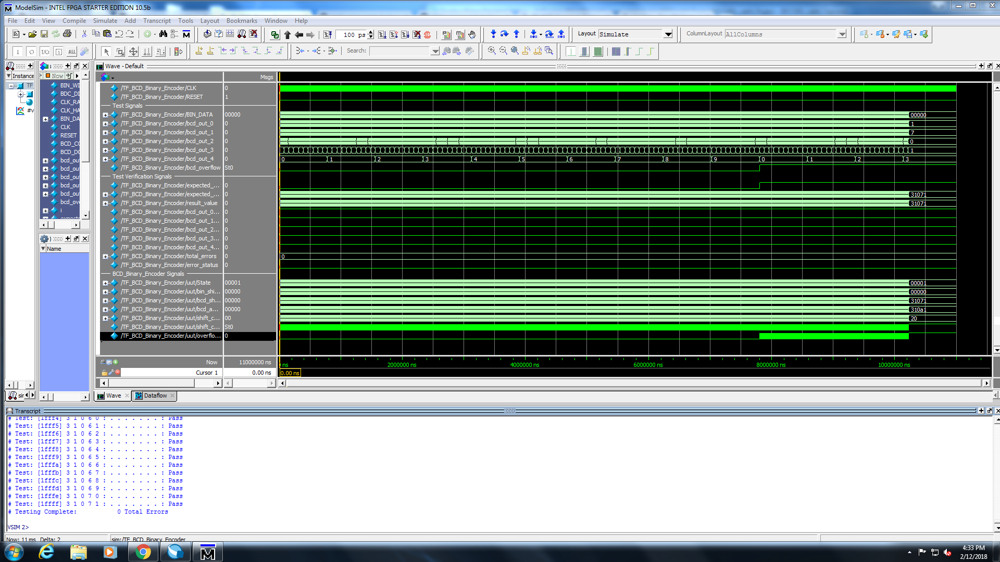
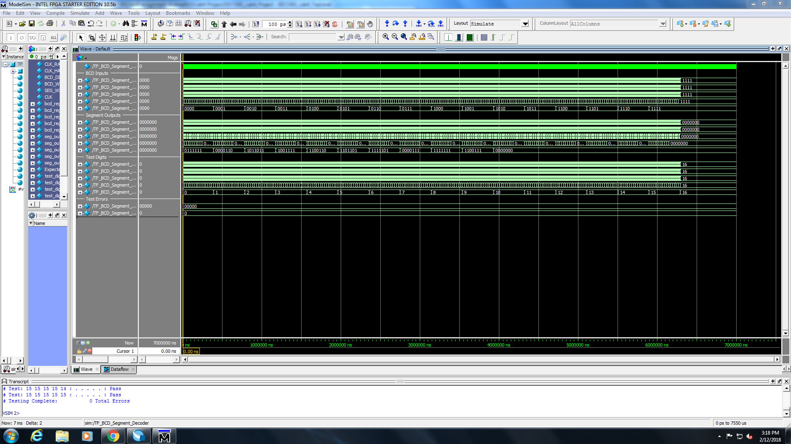

# EECS301 Lab #4 Report

* **Andrea Norris (adn33@case.edu)**
* **Team #6**
* **Github User: AndreaN33**

## Introduction
This project uses State Machines to implement a two-function calculator. This logic is
more complex than the combinatorial logic used previously, and requires case-statement 
implementation.

## Implementation Details
**BCD_Segment_Decoder**
The BCD Segment Decoder takes a Binary-coded decimal (BCD) and converts that value into the
corresponding Seven Segment display value. This was implemented using a lookup table that 
took in the BCD and set the Segment Pattern. 

**Key_Command_Controller**
Key Command Controller is the first of three State Machines implemented in this project. In State 0, 
the controller just waits for key events. If it gets a "clear" input, it sets State to State 2.
if it gets an add or subtract input, it sets State to State 1. In State 1, if a valid key input has been 
entered, the calculater computes. State 1 then goes to State 3, unless the key input was invalid,
in which case it goes back to State 0. State 2 enacts the clear command, and then goes to State 3.
State 3 clears all commands and then waits until the Done signal, where it goes back to State 0.

**Calculator_Module**
Calculator Module is the second State Machine. In State 0, the ready and done signals are cleared.
If the Clear signal is asserted, it sets State to State 3, otherwise if the Compute signal is 
asserted, it sets State to State 1. If these two signals are not asserted it stays in State 0
In State 1, either addition or subtraction is implemented
using a case statement and the Operation signal. Then it sets State to State 2. In State 2, the
accumulator register is set to the output from the adder. The result ready signal and the done 
signal are asserted, and then State is set back to State 0. In State 3, the accumulator register is 
cleared, and result ready and done are asserted. State is then set back to State 0;

**BCD_Binary_Encoder**
The BCD Binary Encoder is the final State machine. It has five states. State 0 is the idle state, which
clears the Done signal, and sets State to State 1 when Convert is asserted. State one sets up the
registers by setting the binary shift register to the binary input data, loading the shift counter 
register with load value, and clearing the overflow flag and the BCD shift register. It then sets 
State to State 2. State 2 shifts the most significant bit from the binary shift register into the
least significant bit of the BCD shift register. The most significant bit of the BCD shift register
is put in the overflow flag, and the least significant bit of the binary shift register is set
to zero. State is then set to State 4 if the shift counter is done, and to State 3 otherwise.
State 3 loads the BCD shift register with the value from the BCD adder sum, and increments the shift
counter. It then automatically sets State to State 2. State 4 sets the BCD output to the BCD shift
register value, and sets BCD Overflow with the overflow flag status. It then asserts the done signal
and returns to State 0.

## Verification Results
This lab was verified through the use of three testbenches, from which two waveforms are included below.
All tests were passed in each run, and once the program was loaded onto the board it performed as expected.

## Conclusions
In implementing and verifying this project, I learned how to construct the framework of a State
Machine and how to implement State Machine logic. I had very few verification difficulties, and 
the only error I did have stemmed from a typing error.

## Computer Usage summary
I spend five hours on the lab computers to complete this lab.

## Time Summary for lab completion
This lab was by far the fastest yet. I spent approximately five hours completing this lab. Three of those hours were code implementation, and two were debugging and validation.